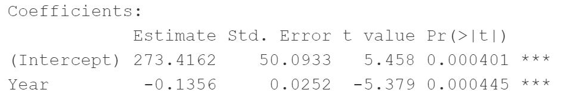
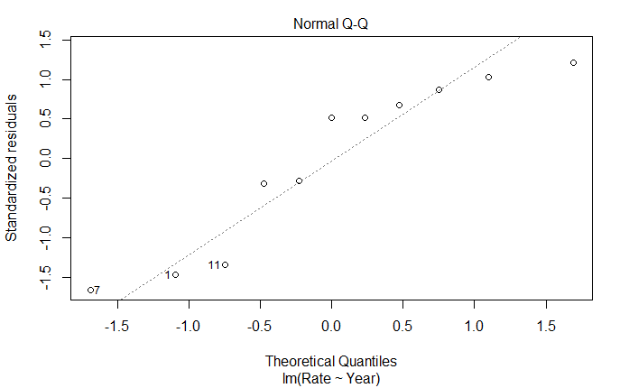

## (1) INTRODUCTION

### Formula and basics

Linear regression: `y = b0 + b1*x + e` where:

+ **b0** and **b1** are known as the regression *beta* coeefficients or *parameters*:
  + *b0* is the intercept of regression line: predicted value when *x = 0*.
  + *b1* is the slope of the regression line.
+ *e* is the error term, the part of y that can be explained through the regression model.

The figure below illustrates the linear regression model, where:

+ the best-fit regression line is in blue
+ the intercept (b0) and the slope (b1) are shown in green
+ the error terms (e) are represented by vertical red lines

```{r, echo=FALSE}
knitr::include_graphics("linear-regression.png")
```

From the scatter plot above it can be observed that not all data points fall on the fitted regression line; some are above it and others below. Overall, this makes the residual errors (e) mean approximately zero.

The sum of the squares of the residual errors are called the **Residual Sum of Squares** or **RSS**.

The average variation of points around the fitted regression line is called the **Residual Standard Error (RSE)**. This is one the metrics used to evaluate the overall quality of the fitted regression model. The lower the RSE, the better it is.

Since the mean error term is zero, the outcome variable y can be approximately estimated as follow:

`y ~ b0 + b1*x`

Mathematically, the beta coefficients (b0 and b1) are determined so that the RSS is as minimal as possible. This method of determining the beta coefficients is technically called **least squares regression** or **ordinary least squares** (OLS) regression.

Once, the beta coefficients are calculated, a t-test is performed to check whether or not these coefficients are significantly different from zero. A non-zero beta coefficients means that there is a significant relationship between the predictors (x) and the outcome variable (y).

### Loading R packages

```{r, results=FALSE, warning=FALSE, message=FALSE}
library("readxl") #importing excel files/data sets
library("tidyverse") #for data manipulation and visualization
```

## (2) DATA DESCRIPTION

### Examples of data and problem

**Deaths caused by Firearms - firearms.xlsx**
The data gives the number of deaths caused by firearms in Australia from 1983 to 1997, expressed as rate per 100,000 of population.

+ Year = Year
+ Rate = Number of deaths caused by firearms per 100,000 population

`We want to predict future rate i.e the number of deaths caused by firearms (per 100k population) in the upcoming years`.

**Importing the data file**

First download the data file from http://www.statsci.org/data/oz/firearms.html, then load the data to an excel file and inspect it as follows.

```{r, echo=TRUE, results='hide'}
firearms <- read_excel("firearms.xlsx")
firearms

firearms_data <- firearms[1:11, ]
firearms_data
```

We also slice the data set to only include the first 11 rows to predict our model. The ignored values are later used to compare the actual death rate and the estimated rate calculated using our model.

### Visualization

+ Create a scatter plot displaying the Death rate (per 100k population) in the respective year.
+ Add a smoothed line

```{r}
ggplot(firearms_data, aes(x = Year, y = Rate)) +
  geom_point() +
  stat_smooth() 
```

The graph above suggests a linearly decreasing relationship between the **Death rate** and **Year** variables. This is a good things because one important assumption of the linear regression is that the relationship beween the outcome (Rate) and predictor variables (Year) is linear and additive.

It's also possible to compute the correlation between the two variables using the R function **`cor()`**:

```{r}
cor(firearms_data$Rate, firearms_data$Year)
```
The correlation coefficient measures the level of the association between two variables x and y. Its value ranges between -1 (perfect negative correlation: when x increases, y decreases) and +1 (perfect positive correlation: when x increases, y increases). 

A value closer to 0 suggests a weak relationship between the variables. In our data the correlation value between the Year and death Rate is -0.8733617 which is closer to -1 and suggests a strong corelation between our variables i.e the variation of the outcome (Rate) is explained by the predictor (Year). 
Hence, we can continue building a linear model of y as a function of x.

## (3) ANALYSIS

### Computation

The simple linear regression tries to find the best line to predict death rate on the basis of the Year.

+ model: `rate = b0 + b1 * Year`

The **`lm()`** function is used to determine the beta coefficients for the linear model:

```{r}
model <- lm(Rate ~ Year, data = firearms_data)
model
```
This result shows the intercept (b0) and the beta coefficient (b1) for the Year variable. 

### Interpretation of Model: firearms data

From the output above:

+ the estimated regression line equation can be written as follow: `rate = 273.416 + (-0.136) * Year`

+ the intercept (b0) is 273.416.

+ the regression beta coefficient for the variable Year (b1), also known as the slope, is -0.136. This can be interpreted as the death rate decreasing by -0.136 units (per 100k population) each year going forward i.e. as the year progresses, the death rate decreases.

### Estimates

We find the estimated death rate given by our model for the next few years and compare them to the actual values.

**Firearms Data**

+ Model: `rate = 273.416 + (-0.136) * Year`

1. Year = 1994
  + Estimate: 2.23
  + Actual: 2.95
  
2. Year = 1995
  + Estimate: 2.096
  + Actual: 2.72
  
3. Year = 1996
  + Estimate: 1.96
  + Actual: 2.96
  
4. Year = 1997
  + Estimate: 1.82
  + Actual: 2.30
  
## (4) MODEL EVALUATION

### Regression line

In the plot below we plot the fitted regression line between our predictor (Year) and outcome (Rate) variables. The line shows a negative correlation between the variables.
The fitted line is also presented with confidence interval around it. The confidence bands reflect the uncertainty about the line.

```{r}
ggplot(firearms_data, aes(x = Year, y = Rate)) +
  geom_point() +
  stat_smooth(method = lm) 
```

### Model Assessment 

In the previous section, we built a linear model of Rate as a function of year: `rate = 273.416 + (-0.136) * Year`

The model we built fits our data to a certain extent as some of the data points are close to the fitted line however, we also have some outliers present.
NOTE (later determined): The model may not be the best fit for our dataset because it covers very few data points and the data frame is really small to form a very fitting model.

We also find that there is a negative correlation between the predictor (Year) and the outcome (rate) variables. To test whether this relationship is statistically significant we do a t-statistic test.

### Model Summary

We start by displaying the statistical summary of the model using the R function `summary()`:

```{r}
summary(model)
```
The summary outputs shows 6 components, including:

+ **Call.** Shows the function call used to compute the regression model. 
  + In this case, displaying rate on the y-axis and Year on the x-axis.
+ **Residuals.** Provide a quick view of the distribution of the residuals, which by definition have a mean zero. Therefore, the median should not be far from zero, and the minimum and maximum should be roughly equal in absolute value. 
  + The minimum, medium, and maximum are displayed as -0.4163, 0.1248, 0.3026 respectively.
+ **Coefficients.** Shows the regression beta coefficients and their statistical significance. Predictor variables, that are significantly associated to the outcome variable, are marked by stars.
+ **Residual standard error** (RSE), **R-squared** (R2) and the **F-statistic** are metrics that are used to check how well the model fits to our data.
  + The RSE is 0.2643 with 9 degrees of freedom, R2 is 0.7628, R2-adjusted is 0.7364 and the F-statistic is 28.94 on 1 and 9 degrees of freedom. Additonally we find that the p-value is 4.449E-4.

### Coefficients significance

The coefficients table, in the model statistical summary, shows:

+ the estimates of the **beta coefficients**
+ the **standard errors** (SE), which defines the accuracy of beta coefficients. For a given beta coefficient, the SE reflects how the coefficient varies under repeated sampling. It can be used to compute the confidence intervals and the t-statistic.
+ the **t-statistic** and the associated **p-value**, which defines the statistical significance of the beta coefficients.

```{r, echo=FALSE}

```

**t-statistic and p-values**

For a given predictor, the t-statistic (and its associated p-value) tests whether or not there is a statistically significant relationship between a given predictor and the outcome variable, that is whether or not the beta coefficient of the predictor is significantly different from zero.

The statistical hypotheses are as follow:

+ Null hypothesis (H0): the coefficients are equal to zero (i.e., no relationship between x and y)
+ Alternative Hypothesis (Ha): the coefficients are not equal to zero (i.e., there is some relationship between x and y)

Mathematically, for a given beta coefficient (b), the t-test is computed as **`t = (b - 0)/SE(b)`**, where SE(b) is the standard error of the coefficient b. The t-statistic measures the number of standard deviations that b is away from 0. Thus a large t-statistic will produce a small p-value.

The higher the t-statistic (and the lower the p-value), the more significant the predictor. The symbols to the right visually specifies the level of significance. The line below the table shows the definition of these symbols; one star means 0.01 < p < 0.05. The more the stars beside the variable’s p-value, the more significant the variable.

A statistically significant coefficient indicates that there is an association between the predictor (x) and the outcome (y) variable.

*In our case, both the p-values for the intercept and the predictor variable are highly significant, so we can reject the null hypothesis and accept the alternative hypothesis, which means that there is a significant association between the predictor and the outcome variables.*

Note: High t-statistics (which go with low p-values near 0) indicate that a predictor should be retained in a model, while very low t-statistics indicate a predictor could be dropped (P. Bruce and Bruce 2017).

**Standard errors and confidence intervals**

The standard error measures the variability/accuracy of the beta coefficients. it can be used to compute the confidence intervals of the coefficients. 

For example, the 95% confidence interval for the coefficient b1 is defined as **`b1 +/- 2*SE(b1)`**, where:

+ the lower limits of `b1 = b1 - 2*SE(b1)` **=** `-0.136 - 2*0.0252` **=** `-0.186`
+ the upper limits of `b1 = b1 + 2*SE(b1)` **=** `-0.136 + 2*0.0252` **=** `-0.085`

That is, there is approximately a 95% chance that the interval [-0.186, -0.085] will contain the true value of b1. Similarly the 95% confidence interval for b0 can be computed as **`b0 +/- 2*SE(b0)`**.

+ the lower limits of `b0 = b0 - 2*SE(b0)` **=** `273.416 - 2*50.09` **=** `173.236`
+ the upper limits of `b0 = b0 + 2*SE(b0)` **=** `273.416 + 2*50.09` **=** `373.596`

There is approximately a 95% chance that the interval [173.236, 373.596] will contain the true value of b0.

To get these information, simply type:

```{r}
confint(model)
```

### Model accuracy

The overall quality of the linear regression fit can be assessed using the following three quantities, displayed in the model summary:

1. The Residual Standard Error (RSE).
2. The R-squared (R2)
3. F-statistic

```{r, echo=FALSE}
data.frame('rse' = 0.2643, 'r.squared' = 0.7628, 'f.statistic' = 28.94, 'p.value' = 4.45e-4)
```

**1. The Residual Standard Error (RSE)**

The RSE (also known as the model sigma) is the residual variation, representing the average variation of the observations points around the fitted regression line. This is the standard deviation of residual errors.

RSE provides an absolute measure of patterns in the data that can’t be explained by the model.

Dividing the RSE by the average value of the outcome variable will give you the prediction error rate, which should be as small as possible.

In our example, RSE = 0.2643, meaning that the observed death rate (per 100k population) deviates from the true regression line by approximately 0.2643 units in average.

Whether or not an RSE of 0.2643 units is an acceptable prediction error is subjective and depends on the problem context. However, we can calculate the percentage error. In our data set, the mean value of sales is 16.827, and so the percentage error is 0.2643/3.952 = 6.687%.

```{r}
mean(firearms_data$Rate)

sigma(model)*100/mean(firearms_data$Rate)
```

**2. R-squared and adjusted R-squared**

The R-squared (R2) ranges from 0 to 1 and represents the proportion of information (i.e. variation) in the data that can be explained by the model. The adjusted R-squared adjusts for the degrees of freedom.

The R2 measures, how well the model fits the data.

A high value of R2 is a good indication. However, as the value of R2 tends to increase when more predictors are added in the model, such as in multiple linear regression model, you should mainly consider the adjusted R-squared, which is a penalized R2 for a higher number of predictors.

+ An (adjusted) R2 that is close to 1 indicates that a large proportion of the variability in the outcome has been explained by the regression model.
+ A number near 0 indicates that the regression model did not explain much of the variability in the outcome.

*In our model the R2 value is 0.7628 and the Adjusted R2 value is 0.7364 which are both closer to one and considerably high, meaning that a lot of the variability in the outcome has been explained by our model.*

**3. F-statistic**

The F-statistic gives the overall significance of the model. It assess whether at least one predictor variable has a non-zero coefficient.

In a simple linear regression, this test is not really interesting since it just duplicates the information given by the t-test, available in the coefficient table. In fact, the F test is identical to the square of the t test: 28.934 = (-5.379)^2. This is true in any model with 1 degree of freedom.

A large F-statistic will corresponds to a statistically significant p-value (p < 0.05). 

*In our model, the F-statistic equals 28.934 producing a p-value of 4.45e-4, which is isn't very significant and hence shows that our model doesn't fit our data very well.*

## (5) CONCLUSION

### Summary

After computing a regression model,we find that our predictor (year) is significantly associated with outcome variable (Rate).

Next we assess how well the model fits the data by inspecting the Residuals Standard Error (RSE), the R2 value and the F-statistics. These metrics give the overall quality of the model.

+ RSE: Closer to zero the better -> our RSE value = 0.26 which is close to zero
+ R-Squared: Higher the better -> our R2 and adjusted R2 values are 0.7628 and 0.7364 respectively which closer to 1 and relatively high
+ F-statistic: Higher the better -> our F statistic value is 29.9 which is very low and our p-value (4.45e-4) is also not significant.

```{r echo = FALSE}
#plot(model)

```

Furthermore, if you look at the qqplot produced below we see that the errors/residuals are not normally distributed in our model because the expected residual data points don't fall on the diagonal line and show a lot of variance. 
This suggests that out linear regression model isn't the best fit for our data. One possible reason for this result may be the use of a very small data set.

## (6) REFERENCES

Bruce, Peter, and Andrew Bruce. 2017. Practical Statistics for Data Scientists. O’Reilly Media.

James, Gareth, Daniela Witten, Trevor Hastie, and Robert Tibshirani. 2014. An Introduction to Statistical Learning: With Applications in R. Springer Publishing Company, Incorporated.

Kassambra. 2018. Regression Analysis: Simple Linear Regression in R. http://www.sthda.com/english/articles/40-regression-analysis/167-simple-linear-regression-in-r/

http://www.statsci.org/data/oz/firearms.html