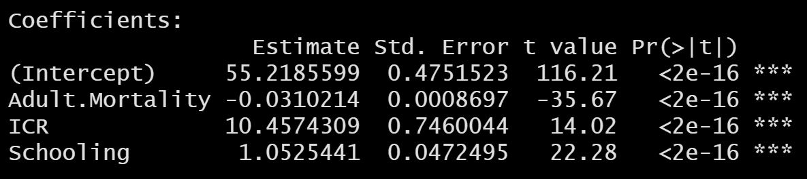

## (1) INTRODUCTION

### Formula and basics

Multiple linear regression: `y = b0 + b1*x1 + b2*x2 + b3*x3 + e` where:

+ *x1*, *x2*, *x3* are explanatory variables.
+ **b0**, **b1**, **b2** and **b3** are known as the regression *beta* coeefficients or *parameters*:
  + *b0* is the intercept of regression line: predicted value when *x = 0*.
  + *b1*, *b2*, *b3* are the slope coefficients for each explanatory variables.
+ *e* is the error term, the part of y that can be explained through the regression model.

### Loading R packages

```{r, results=FALSE, warning=FALSE, message=FALSE}
library("readr") #importing csv file/data sets
library("tidyverse") #for data manipulation and visualization
library("broom")
library("modelr")
library("dplyr")
```

## (2) DATA DESCRIPTION

### Examples of data and problem

**Name of the Data-set: Life Expectancy (WHO)**

The data provides information on various factors (immunization, economic, mortality, social, and other health related factors) and their effect on the Life Expectancy from years 2000 to 2015.
The data is collected from 193 countries from WHO and UN website. 

Our analysis utilizes the information on the following variables from the Dataset:

+ Life Expectancy in age
+ Adult Mortality Rates of both sexes (probability of dying between 15 and 60 years per 1000 population)
+ Human Development Index in terms of income composition of resources (index ranging from 0 to 1)
+ Number of years of Schooling (years)

`We will study the effects of adult mortality rate, Income Composition of Resources (How productively resources are utilized in a country), and Schooling (years of schooling) on the life expectancy of an individual.`

**Importing the data file**

First download the data file from *Kaggle* and then import and extract out the columns of interest. 
Next, since the dataset has some NA values, we omit the rows containing NA values.

```{r, echo=TRUE, results='hide'}
WHO_data <- read.csv("LifeExpectancyData.csv")

WHO_data <- WHO_data[ , c("Country", "Life.expectancy", "Adult.Mortality", "Income.composition.of.resources", "Schooling")] %>% 
  rename(
    "ICR" = "Income.composition.of.resources"
    )

# omit the rows containing any NA values.
WHO_data <- na.omit(WHO_data)

#randomize the rows so the model isn't specific to a few countries since we create a training and testing subset.
set.seed(42)
rows <- sample(nrow(WHO_data)) 
rand_WHO_data <- WHO_data[rows, ] # this is the randomized data set with jumbled rows

Life_Exp <- rand_WHO_data[1:2600, ] # Training data
Life_Exp_test <- rand_WHO_data[2601:2768, ] # test data

rand_WHO_data
Life_Exp
Life_Exp_test
```

### Visualization

+ Create scatter plots displaying the relationship between the outcome variable (Life expectancy) and each predictor variable:
  - Life expectancy (y) vs. Adult Mortality
  - Life expectancy (y) vs. Income composition of Resources
  - Life expectancy (y) vs. Schooling

+ Add a smoothed line, using stat_smooth()

```{r}
ggplot(Life_Exp, aes(x = Adult.Mortality, y = Life.expectancy)) +
  geom_point() +
  stat_smooth() 

ggplot(Life_Exp, aes(x = ICR, y = Life.expectancy)) +
  geom_point() +
  stat_smooth() 

ggplot(Life_Exp, aes(x = Schooling, y = Life.expectancy)) +
  geom_point() +
  stat_smooth()
```

The graphs above suggest a 
- linearly decreasing relationship between the **Life expectancy** and **Adult Mortality** variables. 
- linearly increasing relationship between the **Life expectancy** and **ICR** variables. 
- linearly increasing relationship between the **Life expectancy** and **Schooling** variables. 

This is a good thing because one important assumption of the linear regression is that the relationship beween the outcome (Rate) and predictor variables (Year) is linear and additive.

It's also possible to compute the correlation between the two variables using the R function **`cor()`**:

```{r}
data.frame(
  'LE_AM' = cor(Life_Exp$Life.expectancy, Life_Exp$Adult.Mortality), 
  'LE_ICR' = cor(Life_Exp$Life.expectancy, Life_Exp$ICR),
  'LE_School' = cor(Life_Exp$Life.expectancy, Life_Exp$Schooling)
  )
```

The correlation coefficient measures the level of the association between two variables x and y. Its value ranges between -1 (perfect negative correlation: when x increases, y decreases) and +1 (perfect positive correlation: when x increases, y increases). A value closer to 0 suggests a weak relationship between the variables. 

*In our data the correlation value between the Adult mortality, ICR, Schooling and Life expectancy is -0.6901876, 0.7248019, and 0.7526172 respectively which are closer to either -1 (adult mortality) and 1 (ICR, schooling) and suggests a decent correlation between our variables i.e the variation of the outcome (Life Expectancy) is explained to a good extent by the predictors.*

Hence, we can continue building a linear model of y as a function of x1, x2, x3 (the 3 predictors).

## (3) ANALYSIS

### Computation

```{r}
model <- lm(Life.expectancy ~ Adult.Mortality + ICR + Schooling, data = Life_Exp)
model
```


### Interpretation of Model

+ Model: `Life.expectancy =  55.21856 + (-0.03102) * Adult.Mortality + (10.45743) * ICR + 1.05254 * Schooling`

### Estimates

We find the estimated Life Expectancy in years (age) given by our model for the respective adult mortality, ICR, schooling values and compare them to the actual values.

+ Model: `Life.expectancy =  55.21856 + (-0.03102) * Adult.Mortality + (10.45743) * ICR + 1.05254 * Schooling`

**Life Expectancy Data**

```{r}
# calculate the estimated life expectancy for the test data based on our model. Created a new column that shoes the model calculated 
# expectancy and also another to show the % difference between the expected values and the actual values.

Life_Exp_test  %>% 
  mutate("Expected.LifeExp" = 55.21856 + (-0.03102) * Adult.Mortality + (10.45743) * ICR + 1.05254 * Schooling) %>% 
  mutate("% difference" = ( (Expected.LifeExp - Life.expectancy)/Life.expectancy  ) * 100)
  
```
  
## (4) MODEL EVALUATION

### Regression line

In the scatter plots below, we plot the fitted regression line for each of the explanatory variables (Adult Mortality, ICR, Schooling) against the response variable (Life Expectancy). The fitted regression lines are surrounded by confidence intervals around it that reflects the uncertainty around the line. 

```{r}
ggplot(Life_Exp, aes(x = Adult.Mortality, y = Life.expectancy)) +
  geom_point() +
  stat_smooth(method = lm) 

ggplot(Life_Exp, aes(x = ICR, y = Life.expectancy)) +
  geom_point() +
  stat_smooth(method = lm) 

ggplot(Life_Exp, aes(x = Schooling, y = Life.expectancy)) +
  geom_point() +
  stat_smooth(method = lm) 
```

### Model Assessment 

In the previous sections, we came up with a linear regression model of Life Expectancy as a function of Adult Mortality, ICR and Schooling : 
`Life.expectancy =  55.21856 + (-0.03102) * Adult.Mortality + (10.45743) * ICR + 1.05254 * Schooling`

In the following sections, we will determine the quality of our linear model and determine whether the relationship between the explanatory variables and the response variable is significant. Along with that we will also check if the model we have built fits the data that we have used or not. 

### Model Summary


```{r}
summary(model)
```

### Coefficients significance


```{r, echo=FALSE}

```


```{r}
confint(model)
```

### Model accuracy


```{r, echo=FALSE}
data.frame('rse' = 4.767, 'r.squared' = 0.7377, 'f.statistic' = 2434, 'p.value' = '< 2.2e-16')
```

```{r}
# RSE calculation

mean(Life_Exp$Life.expectancy)

sigma(model)*100/mean(Life_Exp$Life.expectancy)
```

## (5) CONCLUSION

### Summary

```{r}
# par(mfrow = c(2,2))
plot(model)
```


## (6) REFERENCES

James, Gareth, Daniela Witten, Trevor Hastie, and Robert Tibshirani. 2014. An Introduction to Statistical Learning: With Applications in R. Springer Publishing Company, Incorporated.

Kassambra. 2018. Regression Analysis: Multiple Linear Regression in R. http://www.sthda.com/english/articles/40-regression-analysis/168-multiple-linear-regression-in-r/

Data Source: https://www.kaggle.com/kumarajarshi/life-expectancy-who

https://towardsdatascience.com/how-different-factors-have-an-influence-on-your-life-expectancy-7b807b04f33e
