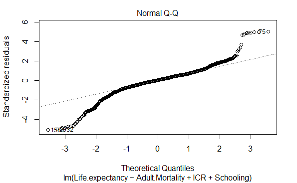

## (1) INTRODUCTION

### Formula and basics

Multiple linear regression: `y = b0 + b1*x1 + b2*x2 + b3*x3 + e` where:

+ *x1*, *x2*, *x3* are explanatory variables.
+ **b0**, **b1**, **b2** and **b3** are known as the regression *beta* coefficients or *parameters*:
  + *b0* is the intercept of regression line: predicted value when *x = 0*.
  + *b1*, *b2*, *b3* are the slope coefficients for each explanatory variables.
+ *e* is the error term, the part of y that can be explained through the regression model.

Note: Beta coefficients measure the association between the predictor variable and the outcome. “b_j” can be interpreted as the average effect on y of a one unit increase in “x_j”, holding all other predictors fixed.

### Loading R packages

```{r, results=FALSE, warning=FALSE, message=FALSE}
library("readr") #importing csv file/data sets
library("tidyverse") #for data manipulation and visualization
library("broom")
library("modelr")
library("dplyr")
library("ggpubr")
```

## (2) DATA DESCRIPTION

### Examples of data and problem

**Name of the Data-set: Life Expectancy (WHO)**

The data provides information on various factors (immunization, economic, mortality, social, and other health related factors) and their effect on the Life Expectancy from years 2000 to 2015.
The data is collected from 193 countries from WHO and UN website. 

Our analysis utilizes the information on the following variables from the Dataset:

+ Life Expectancy in age
+ Adult Mortality Rates of both sexes (probability of dying between 15 and 60 years per 1000 population)
+ Human Development Index in terms of income composition of resources (index ranging from 0 to 1)
+ Number of years of Schooling (years)

*We will study the effects of adult mortality rate, Income Composition of Resources (How productively resources are utilized in a country), and Schooling (years of schooling) on the life expectancy of an individual.*

**Importing the data file**

First download the data file from *Kaggle* and then import and extract out the columns of interest. 
Next, since the dataset has some NA values, we omit the rows containing NA values.

```{r, echo=TRUE, results='hide'}
WHO_data <- read.csv("LifeExpectancyData.csv")

WHO_data <- WHO_data[ , 
  c("Country", "Life.expectancy", "Adult.Mortality", "Income.composition.of.resources", "Schooling")] %>% 
  rename(
    "ICR" = "Income.composition.of.resources"
    )

# omit the rows containing any NA values.
WHO_data <- na.omit(WHO_data)

# randomize the rows so the model isn't specific to a few countries since we create 
# a training and testing subset.
set.seed(42)
rows <- sample(nrow(WHO_data)) 
rand_WHO_data <- WHO_data[rows, ] # this is the randomized data set with jumbled rows

Life_Exp <- rand_WHO_data[1:2600, ] # Training data
Life_Exp_test <- rand_WHO_data[2601:2768, ] # test data

#rand_WHO_data
#Life_Exp
#Life_Exp_test
```

### Visualization

+ Create scatter plots displaying the relationship between the outcome variable (Life expectancy) and each predictor variable:
  + Life expectancy (y) vs. Adult Mortality
  + Life expectancy (y) vs. Income composition of Resources
  + Life expectancy (y) vs. Schooling

+ Add a smoothed line, using stat_smooth()

```{r, warning=FALSE, message=FALSE}
AM <- ggplot(Life_Exp, aes(x = Adult.Mortality, y = Life.expectancy)) +
  geom_point() +
  stat_smooth() 

ICR <- ggplot(Life_Exp, aes(x = ICR, y = Life.expectancy)) +
  geom_point() +
  stat_smooth() 

Sch <- ggplot(Life_Exp, aes(x = Schooling, y = Life.expectancy)) +
  geom_point() +
  stat_smooth()

ggarrange(AM, ICR, Sch, 
          ncol = 3, nrow = 1)
```

The graphs above suggest a 
- linearly decreasing relationship between the **Life expectancy** and **Adult Mortality** variables. 
- linearly increasing relationship between the **Life expectancy** and **ICR** variables. 
- linearly increasing relationship between the **Life expectancy** and **Schooling** variables. 

This is a good thing because one important assumption of the linear regression is that the relationship beween the outcome (life exp.) and predictor variables is linear and additive.

It's also possible to compute the correlation between the two variables using the R function **`cor()`**:

```{r}
data.frame(
  'LE_AM' = cor(Life_Exp$Life.expectancy, Life_Exp$Adult.Mortality), 
  'LE_ICR' = cor(Life_Exp$Life.expectancy, Life_Exp$ICR),
  'LE_School' = cor(Life_Exp$Life.expectancy, Life_Exp$Schooling)
  )
```

The correlation coefficient measures the level of the association between two variables x and y. Its value ranges between -1 (perfect negative correlation: when x increases, y decreases) and +1 (perfect positive correlation: when x increases, y increases). A value closer to 0 suggests a weak relationship between the variables. 

*In our data the correlation value between the Adult mortality, ICR, Schooling and Life expectancy is -0.6901876, 0.7248019, and 0.7526172 respectively which are closer to either -1 (adult mortality) and 1 (ICR, schooling) and suggests a decent correlation between our variables i.e the variation of the outcome (Life Expectancy) is explained to a good extent by the predictors.*

Hence, we can continue building a linear model of y as a function of x1, x2, x3 (the 3 predictors).

## (3) ANALYSIS

### Computation

This multiple linear regression model tries to find the best line to predict Life Expectancy based on **Adult Mortality**, **ICR**, and **Schooling**

The **`lm()`** function is used to determine the beta coefficients for the linear model:

```{r}
model <- lm(Life.expectancy ~ Adult.Mortality + ICR + Schooling, data = Life_Exp)
model
```

This result shows the intercept (b0) and the beta coefficients (b1, b2, b3) for the **Adult Mortality**, **ICR**, and **Schooling** variables.

### Interpretation of Model

+ Model: `Life.expectancy =  55.21856 + (-0.03102) * Adult.Mortality + (10.45743) * ICR + 1.05254 * Schooling`

The first step in interpreting the multiple regression analysis is to examine the F-statistic and the associated p-value, at the bottom of model summary. This is done to ensure that the predictor variables are significant in relation to Life Expectancy; in this case, they are, so all three of our initial predictor variables will stay in the model. See the section on t-statistic and p-values for a detailed explanation of this.

The intercept b0 = 55.21856 represents the predicted value if all variables equal zero; if **Adult Mortality**, **ICR**, and **Schooling** are all zero, the model predicts that the Life Expectancy is 55.21 years, on avarage. 

For a given predictor variable, the coefficient (b) can be interpreted as the average effect on y of a one unit increase in predictor, holding all other predictors fixed.

For example:
+ if Adult Mortality and ICR are fixed, 10 years of Schooling leads to an increase in Life Expectancy by approximately 1.05254*10 = 10.52 years, on average.
+ if Adult Mortality and Schooling are fixed, 0.20 increase in the Human Dev index leads to an increase in Life Expectancy by approximately 10.457*0.10 = 2.10 years in life expectancy, on average. 
+ if ICR and Schooling are fixed, an adult mortality rate of 100, per 1k population, leads to a decrease in Life Expectancy by approximately -0.031*100 = -3.1 years, on average.

### Estimates

We find the estimated Life Expectancy in years (age) given by our model for the respective adult mortality, ICR, schooling values and compare them to the actual values.

+ Model: `Life.expectancy =  55.21856 + (-0.03102) * Adult.Mortality + (10.45743) * ICR + 1.05254 * Schooling`

**Life Expectancy Data**

```{r, echo=TRUE, results='hide'}
# calculate the estimated life expectancy for the test data based on our model. 
# Created a new column that shows the model calculated 
# expectancy and also another to show the % difference between the expected values 
# and the actual values.

Life_Exp_test  %>% 
  select(-("Country")) %>% 
  mutate("Expected.LifeExp" = 55.21856 + 
           (-0.03102) * Adult.Mortality +
           (10.45743) * ICR + 
           1.05254 * Schooling) %>% 
  mutate("% difference" = ( (Expected.LifeExp - Life.expectancy)/Life.expectancy) * 100)
```
  
## (4) MODEL EVALUATION

### Regression line

In the scatter plots below, we plot the fitted regression line for each of the explanatory variables (Adult Mortality, ICR, Schooling) against the response variable (Life Expectancy). The fitted regression lines are surrounded by confidence intervals around it that reflects the uncertainty around the line. 

```{r, warning=FALSE, message=FALSE}
am <- ggplot(Life_Exp, aes(x = Adult.Mortality, y = Life.expectancy)) +
  geom_point() +
  stat_smooth(method = lm) 

icr <- ggplot(Life_Exp, aes(x = ICR, y = Life.expectancy)) +
  geom_point() +
  stat_smooth(method = lm) 

sch <- ggplot(Life_Exp, aes(x = Schooling, y = Life.expectancy)) +
  geom_point() +
  stat_smooth(method = lm) 

ggarrange(am, icr, sch, 
          ncol = 3, nrow = 1)
```

### Model Assessment 

In the previous sections, we came up with a linear regression model of Life Expectancy as a function of Adult Mortality, ICR and Schooling : 
`Life.expectancy =  55.21856 + (-0.03102) * Adult.Mortality + (10.45743) * ICR + 1.05254 * Schooling`

In our model, most of the data points fit our model, however, we also see few outliers that are present in our data set.

We see that there is a negative correlation between the explanatory variable (Adult Mortality) and response variable (Life Expectancy). On the contrary, we find positive correlation for both other explanatory variables (ICR, Schooling) with respect to the response variable (Life Expectancy). 

In the following sections, we will determine the quality of our linear model and determine whether the relationship between the explanatory variables and the response variable is significant. Along with that we will also check if the model we have built fits the data that we have used or not. 

### Model Summary

We start by displaying the statistical summary of the model using the R function `summary()`:

```{r}
summary(model)
```

The summary outputs shows 6 components, including:

+ **Call.** Shows the function call used to compute the regression model. 
  + In this case, displaying rate on the y-axis and the predictor variables adult mortality, ICR and schooling on x-axis.
+ **Residuals.** Provide a quick view of the distribution of the residuals, which by definition have a mean zero. Therefore, the median (0.2752) should not be far from zero, and the minimum (-24.1441) and maximum (23.9416) should be roughly equal in absolute value. 
+ **Coefficients.** Shows the regression beta coefficients and their statistical significance. Predictor variables, that are significantly associated to the outcome variable, are marked by stars.
  + The above table shows that all three variables have a statistical impact on life expectancy.
  + It also proves that there is a **strong positive relationship** between **Life Expectancy** and **ICR** and positive and negative relationship with Schooling and Adult Mortality respectively.
+ **Residual standard error** (RSE), **R-squared** (R2) and the **F-statistic** are metrics that are used to check how well the model fits to our data.
  + The RSE is 4.767 with 2596 degrees of freedom, R2 is 0.7377, R2-adjusted is 0.7374 and the F-statistic is 2434 on 3 and 2596 degrees of freedom. 
  + If the p value is lower than 0.05, it indicates the variable is statistically significant. Our p-value for the F-statistic is < 2.2e-16 which is way smaller than 0.05.

### Coefficients significance

The coefficients table, in the model statistical summary, shows:

+ the estimates of the **beta coefficients**
+ the **standard errors** (SE), which defines the accuracy of beta coefficients. For a given beta coefficient, the SE reflects how the coefficient varies under repeated sampling. It can be used to compute the confidence intervals and the t-statistic.
+ the **t-statistic** and the associated **p-value**, which defines the statistical significance of the beta coefficients.


```{r}
summary(model)$coefficient
```
**Beta coefficients**

For a given predictor variable, the coefficient (b) can be interpreted as the average effect on y of a one unit increase in predictor, holding all other predictors fixed.

For example, for a fixed amount of ICR and # years of schooling, an adult mortality rate of 100 (per 1k population) leads to a decrease in life expectancy by approximately -0.031*100 = 3.1 years, on average.

The ICR coefficient suggests that for every 0.10 unit increase in the Human dev index, holding all other predictors constant, we can expect an increase of 10.457*0.10 = 1.05 years in life expectancy, on average.

The Schooling coefficient suggests that for every 5 years of schooling, holding all other predictors constant, we can expect an increase of 1.0525*5 = 5.26 years in life expectancy, on average.

**t-statistic and p-values**

For a given predictor, the t-statistic (and its associated p-value) tests whether or not there is a statistically significant relationship between a given predictor and the outcome variable, that is whether or not the beta coefficient of the predictor is significantly different from zero.

The statistical hypotheses are as follow:

+ Null hypothesis (H0): the coefficients are equal to zero (i.e., no relationship between x and y)
+ Alternative Hypothesis (Ha): the coefficients are not equal to zero (i.e., there is some relationship between x and y)

Mathematically, for a given beta coefficient (b), the t-test is computed as **`t = (b - 0)/SE(b)`**, where SE(b) is the standard error of the coefficient b. The t-statistic measures the number of standard deviations that b is away from 0. Thus a large t-statistic will produce a small p-value.

The higher the t-statistic (and the lower the p-value), the more significant the predictor. The symbols to the right visually specifies the level of significance. The line below the table shows the definition of these symbols; one star means 0.01 < p < 0.05. The more the stars beside the variable’s p-value, the more significant the variable.

A statistically significant coefficient indicates that there is an association between the predictor (x) and the outcome (y) variable.

*In our case, the p-values (<2e-16) for the intercept and the 3 predictors variable are highly significant, so we can reject the null hypothesis and accept the alternative hypothesis, which means that there is a significant association between the predictors and the outcome variables.*

Note: High t-statistics (which go with low p-values near 0) indicate that a predictor should be retained in a model, while very low t-statistics indicate a predictor could be dropped (P. Bruce and Bruce 2017).

**Standard errors and confidence intervals**

The standard error measures the variability/accuracy of the beta coefficients. it can be used to compute the confidence intervals of the coefficients. 

For example, the 95% confidence interval for the coefficient b3 (Adult mortality) is defined as **`b3 +/- 2*SE(b3)`**, where:

+ the lower limits of `b3 = b3 - 2*SE(b3)` **=** `-0.031 - 2*0.0009` **=** `-0.0328`
+ the upper limits of `b3 = b3 + 2*SE(b3)` **=** `-0.031 + 2*0.0009` **=** `-0.0292`

That is, there is approximately a 95% chance that the interval [-0.0328, -0.0292] will contain the true value of b3. Similarly the 95% confidence interval for b2 (ICR) can be computed as **`b2 +/- 2*SE(b2)`**.

+ the lower limits of `b2 = b2 - 2*SE(b2)` **=** `10.457 - 2*0.746` **=** `8.995`
+ the upper limits of `b2 = b2 + 2*SE(b2)` **=** `273.416 + 2*0.746` **=** `11.920`

That is, there is approximately a 95% chance that the interval [8.995, 11.920] will contain the true value of b2. Similarly the 95% confidence interval for b1 (SChooling) can be computed as **`b1 +/- 2*SE(b1)`**.

+ the lower limits of `b1 = b1 - 2*SE(b1)` **=** `1.053 - 2*0.047` **=** `0.959`
+ the upper limits of `b1 = b1 + 2*SE(b1)` **=** `1.053 + 2*0.047` **=** `1.145`

That is, there is approximately a 95% chance that the interval [0.959, 1.145] will contain the true value of b1. Similarly the 95% confidence interval for b0 can be computed as **`b0 +/- 2*SE(b0)`**.


+ the lower limits of `b0 = b0 - 2*SE(b0)` **=** `55.219 - 2*0.475` **=** `54.289`
+ the upper limits of `b0 = b0 + 2*SE(b0)` **=** `55.219 + 2*0.475` **=** `56.169`

There is approximately a 95% chance that the interval [54.289, 56.169] will contain the true value of b0.

To get these information, simply type:


```{r}
confint(model)
```

### Model accuracy

The overall quality of the linear regression fit can be assessed using the following three quantities, displayed in the model summary:

1. The Residual Standard Error (RSE).
2. The R-squared (R2)
3. F-statistic


```{r, echo=FALSE}
data.frame('rse' = 4.767, 'r.squared' = 0.7377, 'f.statistic' = 2434, 'p.value' = '< 2.2e-16')
```

**1. The Residual Standard Error (RSE)**

The RSE (also known as the model sigma) is the residual variation, representing the average variation of the observations points around the fitted regression line. This is the standard deviation of residual errors.

The RSE estimate gives a measure of error of prediction. The lower the RSE, the more accurate the model (on the data in hand).

Dividing the RSE by the average value of the outcome variable will give you the prediction error rate, which should be as small as possible.

In our example, RSE = 4.767, meaning that the observed life expectancy deviates from the true regression line by approximately 4.767 years of age in average.

Whether or not an RSE of 4.767 units is an acceptable prediction error is subjective and depends on the problem context. However, we can calculate the percentage error. In our data set, the mean value of life expectancy is 69.32612, and so the percentage error is 4.767/69.32612 = 6.875%.

```{r}
# RSE calculation
sigma(model)*100/mean(Life_Exp$Life.expectancy)
```

*In our multiple regression example, the RSE is 4.767 corresponding to 6.9% error rate.*

**2. R-squared and adjusted R-squared**

In multiple linear regression, the R2 represents the correlation coefficient between the observed values of the outcome variable (y) and the fitted (i.e., predicted) values of y. For this reason, the value of R will always be positive and will range from 0 to 1.

The R2 measures how well the model fits the data.

A high value of R2 is a good indication. However, as the value of R2 tends to increase when more predictors are added in the model, such as in multiple linear regression model, you should mainly consider the adjusted R-squared, which is a penalized R2 for a higher number of predictors.

+ An (adjusted) R2 that is close to 1 indicates that a large proportion of the variability in the outcome has been explained by the regression model.
+ A number near 0 indicates that the regression model did not explain much of the variability in the outcome.

*In our model the Adjusted R2 value is 0.7374 meaning that 74% of the variance in the measure of life expectancy can be predicted by adult mortality rate, ICR and Schooling status.*

**3. F-statistic**

The F-statistic gives the overall significance of the model. It assess whether at least one predictor variable has a non-zero coefficient.

As this is not a simple linear regression, this test will provide a significant information about the model that we have calculated to the overall mean of data. We calculate F-statistic with the formula: F-statistic = (MSr/k)/(MSe/(n-k-1)) = (MSr/3)/(MSe/(2596)) = 2434.

A large F-statistic will corresponds to a statistically significant p-value (p < 0.05). 

*In our model, the F-statistic equals 2434 producing a p-value of 2.2e-16. This means that, at least, one of the predictor variables is significantly related to the outcome variable.*

## (5) CONCLUSION

### Summary

After computing a multiple linear regression model, we find that our predictors (adult mortality, income composition of resources, schooling) are significantly associated with outcome variable (Life Expectancy in age).

Next we assess how well the model fits the data by inspecting the Residuals Standard Error (RSE), the R2 value and the F-statistics. These metrics give the overall quality of the model.

+ RSE:  our RSE value = 4.767, which is an acceptible value compared to the mean value of life expectancy
+ R-Squared: Higher the better -> our adjusted R2 value is 0.7374 which closer to 1 and relatively high
+ F-statistic: Higher the better -> our F statistic value is 2434 which is very high and our p-value (2.2e-16) is relatively significant.

```{r, echo = FALSE}
#plot(model)

```
Furthermore, if you look at the qqplot produced above, we see that the errors/residuals are normally distributed in our model because the expected residual data points generally falls on the diagonal line with no strong deviations.
This suggests that out linear regression model is the best fit for our data. 

## (6) REFERENCES

James, Gareth, Daniela Witten, Trevor Hastie, and Robert Tibshirani. 2014. An Introduction to Statistical Learning: With Applications in R. Springer Publishing Company, Incorporated.

Kassambra. 2018. Regression Analysis: Multiple Linear Regression in R. http://www.sthda.com/english/articles/40-regression-analysis/168-multiple-linear-regression-in-r/

Data Source: https://www.kaggle.com/kumarajarshi/life-expectancy-who

https://towardsdatascience.com/how-different-factors-have-an-influence-on-your-life-expectancy-7b807b04f33e
