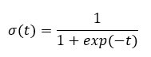
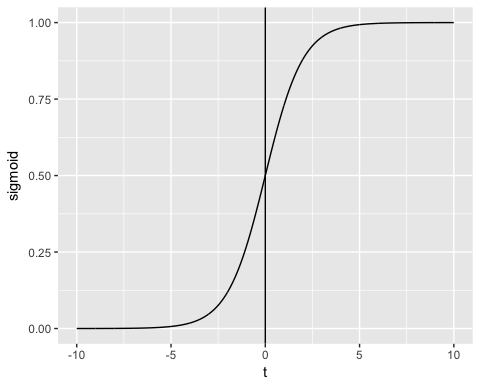
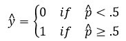

## (1) INTRODUCTION

### Generalized Linear Model: Logistic Regression

Logistic regression is used to predict a class, i.e., a probability. Logistic regression can predict a binary outcome accurately.

Imagine you want to predict whether a a woman wants more children or not based on many attributes. The logistic regression is of the form 0/1. y = 0 if she desires more children, y = 1 if she doesn't.

A logistic regression model differs from linear regression model in two ways.

+ First of all, the logistic regression accepts only dichotomous (binary) input as a dependent variable (i.e., a vector of 0 and 1).
+ Secondly, the outcome is measured by the following probabilistic link function called **sigmoid** due to its S-shaped.:

```{r, echo=FALSE}

```

The output of the function is always between 0 and 1. 

```{r, echo=FALSE}

```

The sigmoid function returns values from 0 to 1. For the classification task, we need a discrete output of 0 or 1.

To convert a continuous flow into discrete value, we can set a decision bound at 0.5. All values above this threshold are classified as 1

```{r, echo=FALSE}

```

### Loading R packages

```{r, results=FALSE, warning=FALSE, message=FALSE}
library("readxl") #importing stata data file
library("dplyr")
library("stats")
library("GGally")
library("ROCR")
library("ggpubr")
library("tidyverse") #for data manipulation and visualization
```

## (2) DATA DESCRIPTION

### Examples of data and problem

****

We used a hypothetical data set produced by UCLA to study the effect of certain variables on the likelihood of admission into graduate school. The variables defines are as follows:

+ GRE (Graduate Record Exam scores)
+ GPA (grade point average) 
+ prestige of the undergraduate institution ranks 1 to 4. 1 being most prestigious and 4 being the least.
+ admission into graduate school. The response variable, 0 (don't admit) / 1 (admit), is a binary variable.

`The objective is to predict whether one will get admission into an institution given their grades and the prestige of the institution`.

**Importing the data file**

```{r, echo=TRUE, results='hide'}
admit_data <- read.csv("https://stats.idre.ucla.edu/stat/data/binary.csv") 

admit_data$admit <- factor(admit_data$admit,
                           levels=c(0,1),
                           labels=c("No", "Yes"))
admit_data$rank <- factor(admit_data$rank,
                           levels=c(1,2,3,4),
                           labels=c("veryHigh", "high", "medium", "low"))
admit_data
```

**Cleaning and preparing the dataset for logistic regression**

#### Checking for Continuous variables

In the first step, you can see the distribution of the continuous variables.

```{r}
# Use the function select_if() from the dplyr library to 
# select only the numerical columns
continuous <-select_if(admit_data, is.numeric)

# Print the summary statistic
summary(continuous)
```
From the above table, you can see that the data has totally different scales and there's large outliers present in `gre` (i.e. look at the min and first quartile values)

You can deal with it following two steps:

**1. Plot the distribution of count**

```{r}
# Histogram with kernel density curve
ggplot(continuous, aes(x = gre)) +
    geom_density(alpha = .2, fill = "#FF6666")
```

The variable has a few outliers and not well-defined distribution. You can partially tackle this problem by deleting the top 0.05 percent of the GRE scores.

```{r}
# Compute the value of the bottom 3% percent of GRE scores
bottom_percent <- quantile(admit_data$gre, 0.03)
bottom_percent
```

```{r}
# drop the observations above this threshold
admit_drop <-admit_data %>%
filter(gre>bottom_percent)

ggplot(admit_drop, aes(x = gre)) +
    geom_density(alpha = .2, fill = "#FF6666")
```

**2: Standardize the continuous variables**

You can standardize each column to improve the performance because your data does not have the same scale. Mutate the numeric colums and then scale them.

```{r}
admit_rescale <- admit_drop %>%
	mutate_if(is.numeric, funs(as.numeric(scale(.))))

head(admit_rescale)
```

#### Checking factor variables

This step has two objectives:

+ Check the level in each categorical column
+ Define new levels

First, we select the categorical columns.

```{r}
# Store the factor columns in factor in a data frame type.
factor <- data.frame(select_if(admit_rescale, is.factor))
	ncol(factor)
```

The dataset contains 2 categorical variables, Admission status and rank of institution.

Next we store the bar chart of each column in a list.

```{r}
# Create graph for each column by automatizing the graphing process
graph <- lapply(names(factor),
    function(x) 
	ggplot(factor, aes(get(x))) +
		geom_bar() +
		theme(axis.text.x = element_text(angle = 90)))

graph #print the 2 graphs we produced
```

### Visualization

No recasting of variables is necessary since we don't have too many levels in either the rank or admission variable. Additionally, despite the fact that some levels of rank have a relatively low number of observations, we find that each level of rank is substantial when it comes to admission.

We can check the number of instances within each group:

```{r}
table(admit_rescale$rank)
```


It is time to check some statistics about our target variables. In the graph below, 

```{r}
ggplot(admit_rescale, aes(x = rank, fill = admit)) +
    geom_bar(position = "fill") +
    theme_classic()
```

```{r}
ggplot(admit_rescale, aes(x = admit, y = gre)) +
    geom_boxplot() +
    stat_summary(fun = mean,
        geom = "point",
        size = 3,
        color = "steelblue") +
    theme_classic()

ggplot(admit_rescale, aes(x = admit, y = gpa)) +
    geom_boxplot() +
    stat_summary(fun = mean,
        geom = "point",
        size = 3,
        color = "steelblue") +
    theme_classic()
```

```{r}
# Plot distribution working time by education
ggplot(admit_rescale, aes(x = gre)) +
    geom_density(aes(color = rank), alpha = 0.5) +
    theme_classic()

ggplot(admit_rescale, aes(x = gpa)) +
    geom_density(aes(color = rank), alpha = 0.5) +
    theme_classic()
```
```{r}
library(ggplot2)
ggplot(admit_rescale, aes(x = gpa, y = gre)) +
    geom_point(aes(color = admit),
        size = 0.5) +
    stat_smooth(method = 'lm',
        formula = y~poly(x, 2),
        se = TRUE,
        aes(color = admit)) +
    theme_classic()
```
## (3) ANALYSIS

### Computation


### Interpretation of Model: 


### Estimates


  
## (4) MODEL EVALUATION

### Regression line


### Model Assessment 


### Model Summary


### Coefficients significance


### Prediction and Model accuracy


## (5) CONCLUSION

### Summary


## (6) REFERENCES

“GLM in R: Generalized Linear Model with Example.” Guru99, 2021, www.guru99.com/r-generalized-linear-model.html. 

Rodríguez, Germán. “GR's Website.” Princeton University, The Trustees of Princeton University, 2020, data.princeton.edu/wws509/datasets/#cuse2. 
