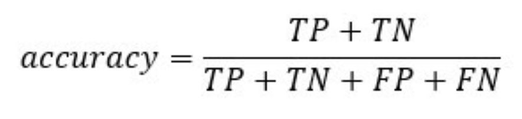

## (1) INTRODUCTION

### Generalized Linear Model: Logistic Regression

Logistic regression is used to predict a class, i.e., a probability. Logistic regression can predict a binary outcome accurately.

Imagine you want to predict whether a a woman wants more children or not based on many attributes. The logistic regression is of the form 0/1. y = 0 if she desires more children, y = 1 if she doesn't.

A logistic regression model differs from linear regression model in two ways.

+ First of all, the logistic regression accepts only dichotomous (binary) input as a dependent variable (i.e., a vector of 0 and 1).
+ Secondly, the outcome is measured by the following probabilistic link function called **sigmoid** due to its S-shaped.:

```{r, echo=FALSE}
knitr::include_graphics("sigmoid.jpg")
```

The output of the function is always between 0 and 1. 

```{r, echo=FALSE}
knitr::include_graphics("graph.png")
```

The sigmoid function returns values from 0 to 1. For the classification task, we need a discrete output of 0 or 1.

To convert a continuous flow into discrete value, we can set a decision bound at 0.5. All values above this threshold are classified as 1

```{r, echo=FALSE}
knitr::include_graphics("threshold.jpg")
```

### Loading R packages

```{r, results=FALSE, warning=FALSE, message=FALSE}
library("readxl") #importing stata data file
library("dplyr")
library("stats")
library("GGally")
library("ROCR")
library("ggpubr")
library("tidyverse") #for data manipulation and visualization
library("ggplot2") 
library("tidyr")
```

## (2) DATA DESCRIPTION

### Examples of data and problem

**Admission into Graduate School**

We used a hypothetical data set produced by UCLA to study the effect of certain variables on the likelihood of admission into graduate school. The variables defines are as follows:

+ GRE (Graduate Record Exam scores)
+ GPA (grade point average) 
+ prestige of the undergraduate institution ranks 1 to 4. 1 being most prestigious and 4 being the least.
+ admission into graduate school. The response variable, 0 (don't admit) / 1 (admit), is a binary variable.

`The objective is to predict whether one will get admission into an institution given their grades and the prestige of the institution`.

**Importing the data file**

```{r, echo=TRUE, results='hide'}
admit_data <- read.csv("https://stats.idre.ucla.edu/stat/data/binary.csv") 

#convert the numerical values for categorical variables to factors
admit_data$admit <- factor(admit_data$admit,
                           levels=c(0,1),
                           labels=c("No", "Yes"))
admit_data$rank <- factor(admit_data$rank,
                           levels=c(1,2,3,4),
                           labels=c("veryHigh", "high", "medium", "low"))
admit_data
```

**Cleaning and preparing the dataset for logistic regression**

#### Checking for Continuous variables

In the first step, you can see the distribution of the continuous variables.

```{r}
# Use the function select_if() from the dplyr library to 
# select only the numerical columns
continuous <-select_if(admit_data, is.numeric)

# Print the summary statistic
summary(continuous)
```
From the above table, you can see that the data has totally different scales and there's large outliers present in `gre` (i.e. look at the min and first quartile values)

You can deal with it following two steps:

**1. Plot the distribution of count**

```{r}
# Histogram with kernel density curve
ggplot(continuous, aes(x = gre)) +
    geom_density(alpha = .2, fill = "#FF6666")
```

The variable has a few outliers and not well-defined distribution. You can partially tackle this problem by deleting the bottom 3 percent of the GRE scores.

```{r}
# Compute the value of the bottom 3% percent of GRE scores
bottom_percent <- quantile(admit_data$gre, 0.03)
bottom_percent
```

```{r}
# drop the observations above this threshold
admit_drop <-admit_data %>%
filter(gre>bottom_percent)

ggplot(admit_drop, aes(x = gre)) +
    geom_density(alpha = .2, fill = "#FF6666")
```

**2: Standardize the continuous variables**

You can standardize each column to improve the performance because your data does not have the same scale. Mutate the numeric colums and then scale them.

```{r}
admit_rescale <- admit_drop %>%
	mutate_if(is.numeric, funs(as.numeric(scale(.))))

head(admit_rescale)
```

#### Checking factor variables

This step has two objectives:

+ Check the level in each categorical column
+ Define new levels

First, we select the categorical columns.

```{r}
# Store the factor columns in factor in a data frame type.
factor <- data.frame(select_if(admit_rescale, is.factor))
ncol(factor)
```

The dataset contains 2 categorical variables, Admission status and rank of institution.

Next we store the bar chart of each column in a list.

```{r}
# Create graph for each column by automatizing the graphing process
graph <- lapply(names(factor),
    function(x) 
	ggplot(factor, aes(get(x))) +
		geom_bar() +
		theme(axis.text.x = element_text(angle = 90)))

graph # print the 2 graphs we produced
```

### Visualization

No recasting of variables is necessary since we don't have too many levels in either the rank or admission variable. Additionally, despite the fact that some levels of rank have a relatively low number of observations, we find that each level of rank is substantial when it comes to admission.

We can check the number of instances within each group:

```{r}
table(admit_rescale$rank)
```


It is time to check some statistics about our target variables. In the graph below, 

```{r}
ggplot(admit_rescale, aes(x = rank, fill = admit)) +
    geom_bar(position = "fill") +
    theme_classic()
```

```{r}
ggplot(admit_rescale, aes(x = admit, y = gre)) +
    geom_boxplot() +
    stat_summary(fun = mean,
        geom = "point",
        size = 3,
        color = "steelblue") +
    theme_classic()

ggplot(admit_rescale, aes(x = admit, y = gpa)) +
    geom_boxplot() +
    stat_summary(fun = mean,
        geom = "point",
        size = 3,
        color = "steelblue") +
    theme_classic()
```

```{r}
# Plot distribution working time by education
ggplot(admit_rescale, aes(x = gre)) +
    geom_density(aes(color = rank), alpha = 0.5) +
    theme_classic()

ggplot(admit_rescale, aes(x = gpa)) +
    geom_density(aes(color = rank), alpha = 0.5) +
    theme_classic()
```
```{r}
ggplot(admit_rescale, aes(x = gpa, y = gre)) +
    geom_point(aes(color = admit),
        size = 0.5) +
    stat_smooth(method = 'lm',
        formula = y~poly(x, 2),
        se = TRUE,
        aes(color = admit)) +
    theme_classic()
```

```{r}
ggplot(admit_rescale, aes(x = gpa, y = gre)) +
    geom_point(aes(color = rank),
        size = 0.5) +
    stat_smooth(method = 'lm',
        formula = y~poly(x, 2),
        se = TRUE,
        aes(color = rank)) +
    theme_classic()
```

**Correlation**

The next check is to visualize the correlation between the variables. You convert the factor level type to numeric so that you can plot a heat map containing the coefficient of correlation computed with the Spearman method.

```{r}
# Convert data to numeric
corr <- data.frame(lapply(admit_rescale, as.integer))
# plot the heat map with the following arguments:
ggcorr(corr, 
    method = c("pairwise", "spearman"), # compute the correlation
    nbreaks = 6, # Number of break
    hjust = 0.8, # Control position of the variable name in the plot
    label = TRUE, # Add labels in the center of the windows
    label_size = 3, # Size labels
    color = "grey50") # Color of the label
```

### Train and test set

Any supervised machine learning task require to split the data between a train set and a test set. You can use the "function" you created in the other supervised learning tutorials to create a train/test set.

```{r}
set.seed(1234)
create_train_test <- function(data, size = 0.8, train = TRUE) {
    n_row = nrow(data)
    total_row = size * n_row
    train_sample <- 1: total_row
    if (train == TRUE) {
        return (data[train_sample, ])
    } else {
        return (data[-train_sample, ])
    }
}
data_train <- create_train_test(admit_rescale, 0.8, train = TRUE)
data_test <- create_train_test(admit_rescale, 0.8, train = FALSE)

dim(data_train)
dim(data_test)
```


## (3) ANALYSIS

### Model Creation and Computation

##Build The Model
```{r}
formula <- admit~.
logit <- glm(formula, data = data_train, family = 'binomial')
summary(logit)

```


###Assess the performance of the model


### Interpretation of Model: 


### Estimates


## (4) MODEL EVALUATION

### Regression line


```{r}
summary(logit)
```


### Model Assessment 


### Model Summary
We start by displaying the statistical summary of the model using the R function summary():


```{r}
summary(logit)

```
The summary of our model reveals interesting information. The performance of a logistic regression is evaluated with specific key metrics.

+ AIC (Akaike Information Criteria): This is the equivalent of R2 in logistic regression. It measures the fit when a penalty is applied to the number of parameters. Smaller AIC values indicate the model is closer to the truth.

+ Null deviance: Fits the model only with the intercept. The degree of freedom is n-1. We can interpret it as a Chi-square value (fitted value different from the actual value hypothesis testing).

+ Residual Deviance: Model with all the variables. It is also interpreted as a Chi-square hypothesis testing.

+ Number of Fisher Scoring iterations: Number of iterations before converging.

The output of the glm() function is stored in a list. The code below shows all the items available in the logit variable we constructed to evaluate the logistic regression.
ch
```{r}

lapply(logit, class)[1:3]

logit$coefficients


```


### Coefficients significance
The coefficients table, in the model statistical summary, shows:
+ the estimates of the beta coefficients
+ the standard errors (SE), which defines the accuracy of beta coefficients. For a given beta coefficient,
the SE reflects how the coefficient varies under repeated sampling.


```{r}
summary(logit)$coef
```


### Prediction and Model accuracy


###Confusion Matrix
The confusion matrix is a better choice to evaluate the classification performance compared with the different metrics you saw before. The general idea is to count the number of times True instances are classified are False.

```{r, echo=FALSE}
knitr::include_graphics("confusionMat.png")
```

To compute the confusion matrix, you first need to have a set of predictions so that they can be compared to the actual targets.

```{r}
predict <- predict(logit, data_test, type = 'response')
# confusion matrix
table_mat <- table(data_test$admit, predict > 0.5)
table_mat
```
Each row in a confusion matrix represents an actual target, while each column represents a predicted target. The first row of this matrix considers the did not get accepted (the False class): 46 were correctly classified as individuals that did not get accepted (**True negative**), while the remaining one was wrongly classified (**False positive**). The second row considers those who get accepted, the positive class were 9 (**True positive**), while the **True negative** was 17 .

You can calculate the model **accuracy** by summing the true positive + true negative over the total observation

```{r, echo=FALSE}

```

```{r}
accuracy_Test <- sum(diag(table_mat)) / sum(table_mat)
accuracy_Test
```

The model appears to suffer from one problem, it overestimates the number of false negatives. This is called the **accuracy test paradox**. We stated that the accuracy is the ratio of correct predictions to the total number of cases. We can have relatively high accuracy but a useless model. It happens when there is a dominant class. If you look back at the confusion matrix, you can see most of the cases are classified as true negative. Imagine now, the model classified all the classes as negative (i.e. did not get accepted). You would have an accuracy of 71 percent (55/55+23). Your model performs better but struggles to distinguish the true positive with the true negative.

In such situation, it is preferable to have a more concise metric. We can look at:

+ Precision=TP/(TP+FP)
+ Recall=TP/(TP+FN)

###Precision vs Recall
**Precision** looks at the accuracy of the positive prediction. **Recall** is the ratio of positive instances that are correctly detected by the classifier;

You can construct two functions to compute these two metrics
1.Construct precision
```{r}
precision <- function(matrix) {
	# True positive
    tp <- matrix[2, 2]
	# false positive
    fp <- matrix[1, 2]
    return (tp / (tp + fp))
}

recall <- function(matrix) {
# true positive
    tp <- matrix[2, 2]# false positive
    fn <- matrix[2, 1]
    return (tp / (tp + fn))
}


prec <- precision(table_mat)
prec
rec <- recall(table_mat)
rec
```

When the model says it is an individual who did not get accepted, it is correct in only 34 percent of the case, and can claim individuals who did not get accepted in 60 percent of the case.

You can create the *F1* score based on the precision and recall. The *F1* is a harmonic mean of these two metrics, meaning it gives more weight to the lower values.

```{r, echo=FALSE}
knitr::include_graphics("F1.jpg")
```


```{r}
f1 <- 2 * ((prec * rec) / (prec + rec))
f1
```

**3.Precision vs Recall **
It is impossible to have both a high precision and high recall.

If we increase the precision, the correct individual will be better predicted, but we would miss lots of them (lower recall). In some situation, we prefer higher precision than recall. There is a concave relationship between precision and recall.

+ Imagine, you need to predict if a patient has a disease. You want to be as precise as possible.
+ If you need to detect potential fraudulent people in the street through facial recognition, it would be better to catch many people labeled as fraudulent even though the precision is low. The police will be able to release the non-fraudulent individual.

**4.The ROC curve **
The **Receiver Operating Characteristic** curve is another common tool used with binary classification. It is very similar to the precision/recall curve, but instead of plotting precision versus recall, the ROC curve shows the true positive rate (i.e., recall) against the false positive rate. The false positive rate is the ratio of negative instances that are incorrectly classified as positive. It is equal to one minus the true negative rate. The true negative rate is also called **specificity**. Hence the ROC curve plots **sensitivity** (recall) versus 1-specificity

To plot the ROC curve, we need to install a library called RORC. We can find in the conda library. You can type the code:

conda install -c r r-rocr --yes

We can plot the ROC with the prediction() and performance() functions.
```{r}
library(ROCR)
data_test$admit
ROCRpred <- prediction(predict, data_test$admit)
ROCRperf <- performance(ROCRpred, 'tpr', 'fpr')
plot(ROCRperf, colorize = TRUE, text.adj = c(-0.2, 1.7))

```

## (5) CONCLUSION

### Summary

For this team essay, we developed a GLM model which predicts whether a student will get admission in a graduate school or not based on his scores and the prestige of the institution.

A **logistic regression** model, that is used to predict binary outcomes (Yes(1) or No(0)), was developed to check if the student was admitted or not.

We used **supervised learning** to create a classifier that predicts if a student will be admitted to a graduate school (Yes) or not (No). Using 80% of the data as our training data set, we trained the logistic regression model and then used the remaining 20% of the data to test the model. On testing our model, we got a decent accuracy of 70.51%. Hence, with approximately 7 out of 10 times, our model can successfully predict the correct classification of whether or not a student will get admission to a Graduate School based on his scores (GPA and GRE) and the prestige of the institution (Rank). 

Also, to determine how well our model fits the data, we inspect the Akaike Information Criteria (AIC), null deviance, Residual Deviance, and the number of Fisher Scoring iterations.
    + AIC (Akaike Information Criteria): We got AIC = 363.6, which is relatively small. Thus we can conclude our model is closer to the truth.
    + Null deviance: We got a small value of Null deviation (388.36 on 309 degrees of freedom), which implies that our model is a good fit.
    + Residual Deviance: The Residual Deviance has reduced by 36.76 with a loss of 5 degrees of freedom. Though it is a significant reduction in deviance, we still got a small value of RD, thus, our model explains the data really well.
    + Number of Fisher Scoring iterations: 4.


## (6) REFERENCES

“GLM in R: Generalized Linear Model with Example.” Guru99, 2021, www.guru99.com/r-generalized-linear-model.html. 

“Logit Regression” IDRE Stats, stats.idre.ucla.edu/r/dae/logit-regression/
