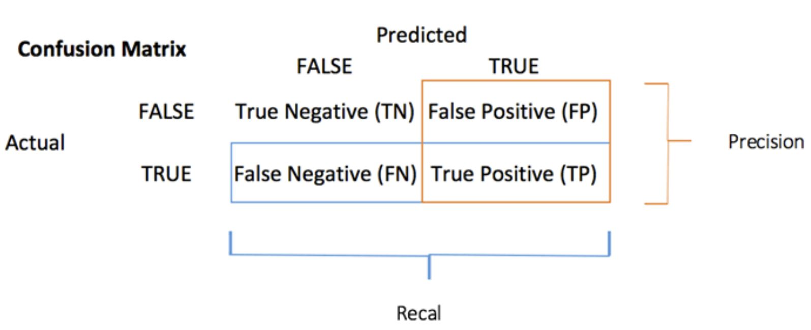
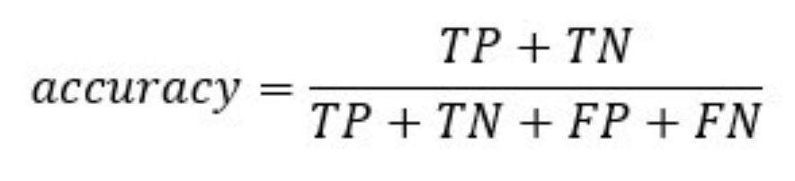
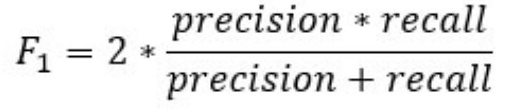

## (1) INTRODUCTION

### Generalized Linear Model: Logistic Regression

Logistic regression is used to predict a class, i.e., a probability. Logistic regression can predict a binary outcome accurately.

Imagine you want to predict whether one would get admitted into grad school like UCLA based on many attributes. The logistic regression is of the form 0/1. y = 0 if one gets rejected, y = 1 if accepted.

A logistic regression model differs from linear regression model in two ways.

+ First of all, the logistic regression accepts only dichotomous (binary) input as a dependent variable (i.e., a vector of 0 and 1).
+ Secondly, the outcome is measured by the following probabilistic link function called **sigmoid** due to its S-shaped.:

```{r, echo=FALSE}
knitr::include_graphics("sigmoid.jpg")
```

The output of the function is always between 0 and 1. 

```{r, echo=FALSE, out.width = "400px"}
knitr::include_graphics("graph.png")
```

The sigmoid function returns values from 0 to 1. For the classification task, we need a discrete output of 0 or 1.

To convert a continuous flow into discrete value, we can set a decision bound at 0.5. All values above this threshold are classified as 1

```{r, echo=FALSE}
knitr::include_graphics("threshold.jpg")
```

### Loading R packages

```{r, results=FALSE, warning=FALSE, message=FALSE}
library("readxl") #importing stata data file
library("dplyr")
library("stats")
library("GGally")
library("ROCR")
library("ggpubr")
library("tidyverse") #for data manipulation and visualization
library("ggplot2") 
library("tidyr")
```

## (2) DATA DESCRIPTION

### Examples of data and problem

**Admission into Graduate School**

We used a hypothetical data set produced by UCLA to study the effect of certain variables on the likelihood of admission into graduate school. The variables defines are as follows:

+ GRE (Graduate Record Exam scores)
+ GPA (grade point average) 
+ prestige of the undergraduate institution ranks 1 to 4. 1 being most prestigious and 4 being the least.
+ admission into graduate school. The response variable, 0 (don't admit) / 1 (admit), is a binary variable.

*The objective is to predict whether one will get admission into an institution given their grades and the prestige of their undergrad institution.*

**Importing the data file**

```{r, echo=TRUE, results='hide'}
admit_data <- read.csv("https://stats.idre.ucla.edu/stat/data/binary.csv") 
#convert the numerical values for categorical variables to factors
admit_data$admit <- factor(admit_data$admit,
                           levels=c(0,1),
                           labels=c("No", "Yes"))
admit_data$rank <- factor(admit_data$rank,
                           levels=c(1,2,3,4),
                           labels=c("veryHigh", "high", "medium", "low"))
admit_data
```

**Cleaning and preparing the dataset for logistic regression**

**1. Checking for Continuous variables**

In the first step, you can see the distribution of the continuous variables.

```{r}
# Use the function select_if() from the dplyr library to 
# select only the numerical columns
continuous <-select_if(admit_data, is.numeric)
# Print the summary statistic
summary(continuous)
```

From the above table, you can see that the data has totally different scales and there's large outliers present in `gre` (i.e. look at the min and first quartile values)

You can deal with it following two steps:

**1a. Plot the distribution of count**

```{r}
# Histogram with kernel density curve
ggplot(continuous, aes(x = gre)) +
    geom_density(alpha = .2, fill = "#FF6666")
```

The variable has a few outliers and not well-defined distribution. You can partially tackle this problem by deleting the bottom 3 percent of the GRE scores.

```{r}
# Compute the value of the bottom 3% percent of GRE scores
bottom_percent <- quantile(admit_data$gre, 0.03)
bottom_percent
```

```{r}
# drop the observations above this threshold
admit_drop <-admit_data %>%
filter(gre>bottom_percent)
ggplot(admit_drop, aes(x = gre)) +
    geom_density(alpha = .2, fill = "#FF6666")
```

**1b: Standardize the continuous variables**

You can standardize each column to improve the performance because your data does not have the same scale. Mutate the numeric colums and then scale them.

This was the original choice however, it made reading the data and graphs a little harder with the standardized scales so we reverted to the original non-standardized values.

```{r}
admit_rescale <- admit_drop

# admit_rescale <- admit_drop %>%
# mutate_if(is.numeric, funs(as.numeric(scale(.))))

head(admit_rescale)
```

**2. Checking factor variables**

This step has two objectives:

+ Check the level in each categorical column
+ Define new levels

First, we select the categorical columns.

```{r}
# Store the factor columns in factor in a data frame type.
factor <- data.frame(select_if(admit_rescale, is.factor))
ncol(factor)
```

The dataset contains 2 categorical variables, Admission status and rank of undergrad institution.

Next we store the bar chart of each column in a list.

```{r}
# Create graph for each column by automatizing the graphing process
graph <- lapply(names(factor),
    function(x) 
	ggplot(factor, aes(get(x))) +
		geom_bar() +
		theme(axis.text.x = element_text(angle = 90)))
graph # print the 2 graphs we produced
```

We can observe from the above graphs that majority of the individuals didn't get into the grad schools. And most of the applicants seem to have come from a high ranked institution. But we don't see how these two graphs relate so we do further analysis in the next few sections.

### Visualization

No recasting of variables is necessary since we don't have too many levels in either the rank or admission variable. Additionally, despite the fact that some levels of rank have a relatively low number of observations, we find that each level of rank is substantial when it comes to admission.

We can check the number of instances within each group:

```{r}
table(admit_rescale$rank)
```

It is time to check some statistics about our target variables. In the graph below, we see that the greater the rank of the institution a student did their undergrad from, the higher is their chance of getting admitted.

```{r, echo = FALSE}
ggplot(admit_rescale, aes(x = rank, fill = admit)) +
    geom_bar(position = "fill") +
    theme_classic()
```

In this net plot we see, through the use of standardized gpa and gre values, the chances of being admitted. From what we see, it seems that a higher GPA and a higher GRE score increases the chnaces of admission. WHich one has more effect cannot really be determined in this plot.

```{r, echo=FALSE}
gre_g <- ggplot(admit_rescale, aes(x = admit, y = gre)) +
    geom_boxplot() +
    stat_summary(fun = mean,
        geom = "point",
        size = 3,
        color = "steelblue") +
    theme_classic()
gpa_g <- ggplot(admit_rescale, aes(x = admit, y = gpa)) +
    geom_boxplot() +
    stat_summary(fun = mean,
        geom = "point",
        size = 3,
        color = "steelblue") +
    theme_classic()
ggarrange(gre_g, gpa_g, 
          ncol = 2, nrow = 1)
```

Next we visualize the density distributions for the gre and gpa scores categorized by rank. 
We observe that the low rank and medium ranks are concentrated around the lower GRE scores; whereas, the GRE scores of students from high/very high ranked institutions are concentrated around the greater GRE scores. In other words, the plot is skewed to the left for low ranked institutes vs more even distribution for high ranks.
We don't observe many differences for the GPA values except for the tail on the right where you observe that the higher ranks are more evenly distributed over the higher gpa values which isn't the same for low ranked institutes.

```{r, echo = FALSE}
# Plot distribution working time by education
gre_line <- ggplot(admit_rescale, aes(x = gre)) +
  geom_density(aes(color = rank), alpha = 0.5) +
  theme_classic() +
  facet_wrap(~rank)

gpa_line <- ggplot(admit_rescale, aes(x = gpa)) +
  geom_density(aes(color = rank), alpha = 0.5) +
  theme_classic()+
  facet_wrap(~rank)

ggarrange(gre_line, gpa_line, 
          ncol = 1, nrow = 2)
```

We created a linear regression model comparing gre and gpa and their impact on admittance. We observe three things from this plot:

  1. The line displaying admittance shows that GPA and GRE tend to be higher than no admittance. 
  2. Regardless of admittance, GRE and GPA tend to be positively correlated meaning the higher the GPA, the higher the GRE tends to be for individuals.
  3. It can also be observed that individuals with low gpa scores, higher GRE scores can increase your chances of admittance. 
  
It may even be hypothesized that GRE scores make a bigger impact on admittance than GPA. For the same GPA, Having a higher GRE score may get you admitted into the graduate school. Mind you this doesn't take into consideration the rank of undergrad institutions.
  
```{r, echo = FALSE}
ggplot(admit_rescale, aes(x = gpa, y = gre)) +
    geom_point(aes(color = admit),
        size = 0.5) +
    stat_smooth(method = 'lm',
        formula = y~poly(x, 2),
        se = TRUE,
        aes(color = admit)) +
    theme_classic()
```

**Correlation**

The next check is to visualize the correlation between the variables. You convert the factor level type to numeric so that you can plot a heat map containing the coefficient of correlation computed with the Spearman method.

```{r}
# Convert data to numeric
corr <- data.frame(lapply(admit_rescale, as.integer))
# plot the heat map with the following arguments:
ggcorr(corr, 
    method = c("pairwise", "spearman"), # compute the correlation
    nbreaks = 4, # Number of break
    hjust = 0.8, # Control position of the variable name in the plot
    label = TRUE, # Add labels in the center of the windows
    label_size = 3, # Size labels
    color = "grey50") # Color of the label
```

We find a weak correlation between the variables but we correctly observe that gpa and gre have a positive correlation with admittance, whereas rank has a negative correlation with all other variables.

### Train and test set

Any supervised machine learning task require to split the data between a train set and a test set. You can use the "function" you created in the other supervised learning tutorials to create a train/test set.

```{r}
set.seed(1234)
create_train_test <- function(data, size = 0.8, train = TRUE) {
    n_row = nrow(data)
    total_row = size * n_row
    train_sample <- 1: total_row
    if (train == TRUE) {
        return (data[train_sample, ])
    } else {
        return (data[-train_sample, ])
    }
}
data_train <- create_train_test(admit_rescale, 0.8, train = TRUE)
data_test <- create_train_test(admit_rescale, 0.8, train = FALSE)
dim(data_train)
dim(data_test)
```

## (3) ANALYSIS

### Computation

The code below estimates a logistic regression model using the glm (generalized linear model) function. The purpose is to predict the admittance status based on a set a different features (gre, gpa, rank).

```{r}
logit <- glm( admit ~ gre + gpa + rank, 
              data = data_train, na.action="na.exclude", 
              family = binomial(link='logit'))
logit
```

This result shows the intercept (b0) and the beta coefficients (b1, b2, b3, b4 ,b5) for the **GRE**, **GPA**, **rankhigh**, **rankmedium**, and **ranklow** variables.

### Interpretation: 

+ **Model**: Admit = -4.57174 + 0.002445 * GRE + 0.9648 * GPA + 
(-0.71967) * rankhigh + (-1.5836) * rankmedium + (-1.5125) * ranklow

The intercept b0 = 0.1683 represents the predicted value if all variables equal zero; if **GRE**, **GPA**, **rankhigh**, **rankmedium**, and **ranklow** are all zero, the model predicts that the admission rate is -4.57174 on average. 

The logistic regression coefficients give the change in the log odds of the outcome for a one unit increase in the predictor variable.

+ For every one unit change in gre, the log odds of admission (versus non-admission) increases by 0.002445.
+ For a one unit increase in gpa, the log odds of being admitted to graduate school increases by 0.964802.
+ The indicator variables for rank have a slightly different interpretation. For example, having attended an undergraduate institution with rank of high, versus an institution with a rank of very high, changes the log odds of admission by -0.71967.

## (4) MODEL EVALUATION

### Regression line

```{r, echo=FALSE, results='hide'}
# save the coefficient values so we can use them in the equations
b0 <- logit$coef[1] # intercept
gre <- logit$coef[2]
gpa <- logit$coef[3]
rankhigh <- logit$coef[4]
rankmedium <- logit$coef[5]
ranklow <- logit$coef[6]

# The GRE range we set here will determine the range on the 
# x-axis of the final plot
gre_range <- seq(from=min(data_train$gre), to=max(data_train$gre), by=.01)
# by plugging in the mean as the value for GPA, we'll be 
# generating plots that show the relationship between GRE and 
# the outcome "for someone with an average GPA".
gpa_val <- mean(data_train$gpa)
# Next, compute the equations for each group in logit terms. 
# You’ll need to plug in values for all but one variable – whichever 
# variable you decided will be displayed on the x-axis of your plot. 
# You make a separate equation for each group by plugging in 
# different values for the group dummy codes.
ref_logits <- b0 + 
  gre*gre_range + 
  gpa*gpa_val + 
  rankhigh*0 + 
  rankmedium*0 + 
  ranklow * 0
  
high_logits <- b0 + 
  gre*gre_range + 
  gpa*gpa_val + 
  rankhigh*1 + 
  rankmedium*0 + 
  ranklow * 0

medium_logits <- b0 + 
  gre*gre_range + 
  gpa*gpa_val + 
  rankhigh*0 + 
  rankmedium*1 + 
  ranklow * 0

low_logits <- b0 + 
  gre*gre_range + 
  gpa*gpa_val + 
  rankhigh*0 + 
  rankmedium*0 + 
  ranklow * 1
 
# Compute the probabilities (this is what will actually get plotted):
a_probs <- exp(ref_logits)/(1 + exp(ref_logits))
b_probs <- exp(high_logits)/(1 + exp(high_logits))
c_probs <- exp(medium_logits)/(1 + exp(medium_logits))
d_probs <- exp(low_logits)/(1 + exp(low_logits))
  
 
plot.data <- data.frame(reference=a_probs, high=b_probs, medium=c_probs, low=d_probs, GRE=gre_range)
plot.data <- gather(plot.data, key=rank, value=prob, reference:low)
head(plot.data)
```

```{r, echo=FALSE}
# asking it to set the color by the variable "group" is what makes it draw three different lines
ggplot(plot.data, aes(x=GRE, y=prob, color=rank), size = 0.1) +
  geom_line(lwd=1) + 
  labs(x="GRE", y="P(Admission rate)", title="Probability of getting accepted") 
```

Based on the logistic curve of the probability an individual getting accepted to their desired institution w.r.t to their GRE, we can infer that:

+ individuals with higher GRE score have a higher chance to get into their desire institute compare to those with lower GRE.
+ We also see that the more prestigious the undergrad institute that one graduated from, the higher is the probability of them getting accepted to grad school. We see a wide gap between the medium and low ranked groups and the high ranked group.

### Model Assessment 

In the previous sections, we came up with a logistic regression model of admittance as a function of GPA, GRE and various ranks of undergrad institutes:

**Admit** = (-4.57174) + 0.002445 * GRE + 0.9648 * GPA + 
(-0.71967) * rankhigh + (-1.5836) * rankmedium + (-1.5125) * ranklow

We observed trends that how various variables such as gre, rank, etc. affect the probability of admittance; however, it is possible that the model can be improved and we need to do more in depth statistical analysis of the model to see how well it fits the data. In the next few sections we will further assess the model based on the summary and various analysis methods.

### Model Summary

We start by displaying the statistical summary of the model using the R function summary():

```{r, echo=FALSE}
summary(logit)
```

The performance of a logistic regression is evaluated with specific key metrics.

The summary outputs shows 7 components, including:

+ **Call**: Shows the function call used to compute the regression model.

+ **Deviance residuals**, which are a measure of model fit. This part of output shows the distribution of the deviance residuals for individual cases used in the model.

+ **Coefficients**, their **standard errors**, the **z-statistic** (sometimes called a Wald z-statistic), and the associated **p-values**. Since the p-value is less than or equal to the significance level of 0.05, we can conclude that all the predictors are statistically significant.

+ **Null deviance:** Fits the model only with the intercept. The degree of freedom is n-1. We can interpret it as a Chi-square value (fitted value different from the actual value hypothesis testing). We find it to be 383.36 on 309 DF.

+ **Residual Deviance:** Model with all the variables. It is also interpreted as a Chi-square hypothesis testing. We find it to be 351.6 on 304 DF.

+ **AIC (Akaike Information Criteria):** This is the equivalent of R2 in logistic regression. It measures the fit when a penalty is applied to the number of parameters. It is used to compare different models. Smaller AIC values indicate the model is closer to the truth. We find the AIC for our data to be 363.6.

+ **Number of Fisher Scoring iterations:** Number of iterations before converging. In our case, number of FSI is 4.

### Coefficients significance

The coefficients table, in the model statistical summary, shows:

+ The glm function internally encodes categorical variables into n - 1 distinct levels.
+ **Estimate** represents the regression coefficients value. Here, the regression coefficients explain the change in log(odds) of the response variable for one unit change in the predictor variable.
+ **Std. Error** (SE) represents the standard error associated with the regression coefficients.
+ **z value** is analogous to t-statistics in multiple regression output. z value > 2 implies the corresponding variable is significant.
+ **p value** determines the probability of significance of predictor variables. With 95% confidence level, a variable having p < 0.05 is considered an important predictor. The same can be inferred by observing stars against p value.

```{r}
summary(logit)$coef
```

In addition, we can also perform an ANOVA Chi-square test to check the overall effect of variables on the dependent variable.

```{r}
anova(logit, test = 'Chisq')
```

Following are the insights we can collect for the output above:

+ The AIC value of this model is 363.6
Following are the insights we can collect for the output above:
+ Normally we would check which variables aren't significant in presence of others and we'd try building another model without including them in order to reduce AIC. However, we find that we don't have many variables to begin with and all of them are, more or less, significant. So there isn't much we can do to improve this model.

**Standard errors and confidence intervals**

We can use the confint function to obtain confidence intervals for the coefficient estimates. Note that for logistic models, confidence intervals are based on the profiled log-likelihood function. We can also get CIs based on just the standard errors by using the default method.

```{r}
# CIs using profiled log-likelihood
confint(logit)
# CIs using standard errors
confint.default(logit)
```

We can test for an overall effect of rank using the wald.test function of the aod library. We use the wald.test function. b supplies the coefficients, while Sigma supplies the variance covariance matrix of the error terms, finally Terms tells R which terms in the model are to be tested, in this case, terms 4, 5, and 6, are the three terms for the levels of rank.
 
```{r}
library(aod)
wald.test(b = coef(logit), Sigma = vcov(logit), Terms = 4:6)
```

The chi-squared test statistic of 19.3, with three degrees of freedom is associated with a p-value of 0.00024 indicating that the overall effect of rank is statistically significant.

### Prediction and Model accuracy

In Linear Regression, we check adjusted R², F Statistics, MAE, and RMSE to evaluate model fit and accuracy. But, Logistic Regression employs all different sets of metrics. Here, we deal with probabilities and categorical values. Following are the evaluation metrics used for Logistic Regression (in addition to AIC, Null and Residual deviance):

**1. Confusion Matrix **

The confusion matrix is a better choice to evaluate the classification performance compared with the different metrics you saw before. The general idea is to count the number of times True instances are classified are False.

```{r, echo=FALSE}

```

To compute the confusion matrix, you first need to have a set of predictions so that they can be compared to the actual targets.

```{r, results='hide'}
# Compute the prediction on the test set. Set type = 'response' 
# to compute the response probability
predict <- data_test
predict$rankP <- predict(logit, data_test, type = 'response')
predict
```

Each row in a confusion matrix represents an actual target, while each column represents a predicted target. 

```{r}
# confusion matrix; predict > 0.5 means it returns 1 if the 
# predicted probabilities are above 0.5, else 0.
table_mat <- table(predict$admit, predict$rankP > 0.5)
table_mat
```

The first row of this matrix considers the rejected i.e. not admitted candidates (the False class): 46 were correctly classified as individuals who did not get admitted (**True negative**), while the remaining 6 was wrongly classified as admitted (**False positive**). The second row considers the cases of admittance, the positive class were 9 (**True positive**), while the **False negative** was 17.

You can calculate the model accuracy by summing the true positive + true negative over the total observation

```{r, echo=FALSE}

```

```{r}
accuracy_Test <- sum(diag(table_mat)) / sum(table_mat)
accuracy_Test
```

The model appears to suffer from one problem, it overestimates the number of false negatives. This is called the **accuracy test paradox**. We stated that the accuracy is the ratio of correct predictions to the total number of cases. We can have relatively high accuracy but a useless model. It happens when there is a dominant class. If you look back at the confusion matrix, you can see most of the cases are classified as true negative. 

In such situation, it is preferable to have a more concise metric. We can look at:

+ Precision=TP/(TP+FP)
+ Recall=TP/(TP+FN)

**2. Precision vs Recall **

Precision looks at the accuracy of the positive prediction. Recall is the ratio of positive instances that are correctly detected by the classifier;

You can construct two functions to compute these two metrics:

```{r}
precision <- function(matrix) {
	# True positive
    tp <- matrix[2, 2]
	# false positive
    fp <- matrix[1, 2]
    return (tp / (tp + fp))
}
recall <- function(matrix) {
# true positive
    tp <- matrix[2, 2]# false positive
    fn <- matrix[2, 1]
    return (tp / (tp + fn))
}
prec <- precision(table_mat)
prec
rec <- recall(table_mat)
rec
```

When the model says an individual gt admitted to grad school, it is correct in only 35 percent of the case, and can claim individuals got admitted in 60 percent of the case.

You can create the **F1** score based on the precision and recall. The **F1** is a harmonic mean of these two metrics, meaning it gives more weight to the lower values.

```{r, echo=FALSE}

```

```{r}
f1 <- 2 * ((prec * rec) / (prec + rec))
f1
```

**3. Precision vs Recall tradeoff**

It is impossible to have both a high precision and high recall.

If we increase the precision, the correct individual will be better predicted, but we would miss lots of them (lower recall). In some situation, we prefer higher precision than recall. There is a concave relationship between precision and recall.

+ Imagine, you need to predict if a patient has a disease. You want to be as precise as possible.
+ If you need to detect potential fraudulent people in the street through facial recognition, it would be better to catch many people labeled as fraudulent even though the precision is low. The police will be able to release the non-fraudulent individual.

**4. The ROC curve **

ROC determines the accuracy of a classification model at a user defined threshold value. It determines the model's accuracy using Area Under Curve (AUC). The area under the curve (AUC), also referred to as index of accuracy (A) or concordant index, represents the performance of the ROC curve. Higher the area, better the model. ROC is plotted between **True Positive Rate** (Y axis) and **False Positive Rate** (X Axis).

The false positive rate is the ratio of negative instances that are incorrectly classified as positive. It is equal to one minus the true negative rate. The true negative rate is also called specificity. Hence the ROC curve plots sensitivity (recall) versus 1-specificity (fpr).

We can plot the ROC with the prediction() and performance() functions.

```{r, echo=FALSE, message=FALSE, warning=FALSE}
library(Metrics)

ROCRpred <- prediction(predict$rankP, predict$admit)
ROCRperf <- performance(ROCRpred, 'tpr', 'fpr')
plot(ROCRperf, colorize = TRUE, text.adj = c(-0.2, 1.7))
```

## (5) CONCLUSION

### Summary

For this team essay, we developed a GLM model which predicts whether a student will get admission in a graduate school or not based on his scores and the prestige of the institution.

A **logistic regression** model, that is used to predict binary outcomes (Yes(1) or No(0)), was developed to check if the student was admitted or not.

We used **supervised learning** to create a classifier that predicts if a student will be admitted to a graduate school (Yes) or not (No). Using 80% of the data as our training data set, we trained the logistic regression model and then used the remaining 20% of the data to test the model. On testing our model, we got a decent accuracy of 70.51%. Hence, with approximately 7 out of 10 times, our model can successfully predict the correct classification of whether or not a student will get admission to a Graduate School based on his scores (GPA and GRE) and the prestige of the institution (Rank). 

Also, to determine how well our model fits the data, we inspect the Akaike Information Criteria (AIC), null deviance, Residual Deviance, and the number of Fisher Scoring iterations.

+ AIC (Akaike Information Criteria): We got AIC = 363.6, which is relatively small. Thus, we can conclude our model is closer to the truth.

+ Null deviance: We got a small value of Null deviation (388.36 on 309 degrees of freedom), which implies that our model is a good fit.

+ Residual Deviance: The Residual Deviance (351.6 on 304 DF) has reduced by 36.76 with a loss of 5 degrees of freedom. The larger the difference between null and residual deviance, better the model. Though it is a significant reduction in deviance, we still got a small value of RD, thus, our model explains the data really well.

## (6) REFERENCES

“GLM in R: Generalized Linear Model with Example.” Guru99, 2021, www.guru99.com/r-generalized-linear-model.html. 

“Logit Regression” IDRE Stats, stats.idre.ucla.edu/r/dae/logit-regression/

https://www.hackerearth.com/practice/machine-learning/machine-learning-algorithms/logistic-regression-analysis-r/tutorial/

https://blogs.uoregon.edu/rclub/2016/04/05/plotting-your-logistic-regression-models/
