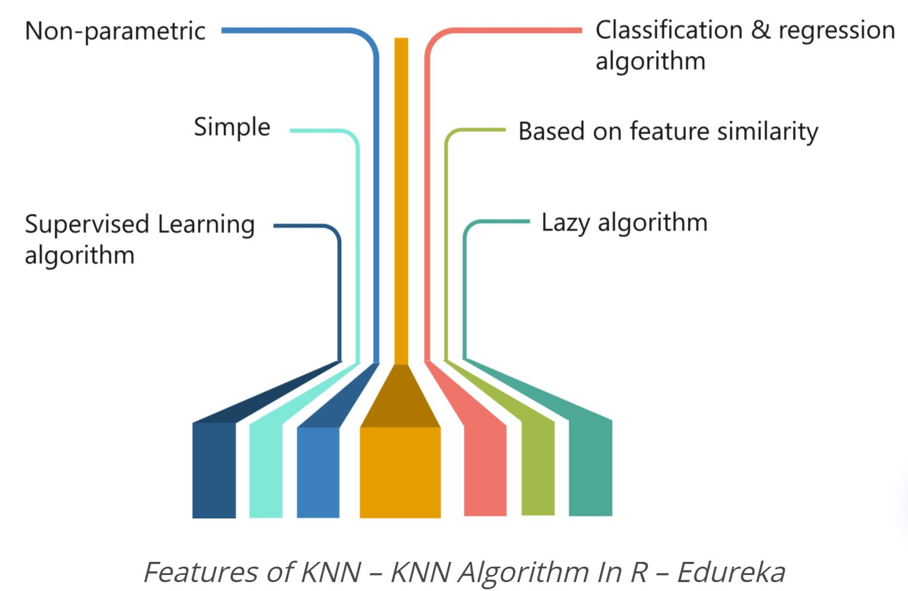
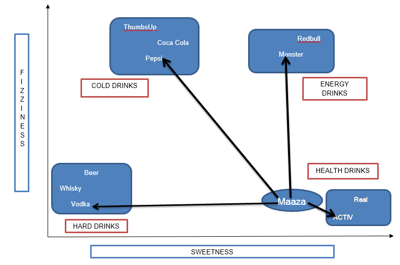
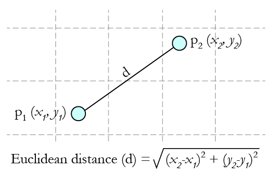

## (1) INTRODUCTION

### KNN and Decision trees

k nearest neighbors (kNN) is a simple algorithm that stores all available cases and classifies new cases by a majority vote of its k neighbors. This algorithms segregates unlabeled data points into well defined groups. 

In other words, KNN which stands for K Nearest Neighbor is a Supervised Machine Learning algorithm that classifies a new data point into the target class, depending on the features of its neighboring data points. It can be used to solve both classification and regression tasks.

**Features of KNN**

```{r, echo = FALSE}

```

+ KNN is a Supervised Learning algorithm that uses labeled input data set to predict the output of the data points.

+ It is one of the most simple Machine learning algorithms and it can be easily implemented for a varied set of problems.

+ It is mainly based on feature similarity. KNN checks how similar a data point is to its neighbor and classifies the data point into the class it is most similar to.

+ Unlike most algorithms, KNN is a non-parametric model which means that it does not make any assumptions about the data set. This makes the algorithm more effective since it can handle realistic data.

+ KNN is a lazy algorithm, this means that it memorizes the training data set instead of learning a discriminative function from the training data.

+ KNN can be used for solving both classification and regression problems.

**Method to find appropriate k value**

Choosing the number of nearest neighbors i.e. determining the value of k plays a significant role in determining the efficacy of the model. Thus, selection of k will determine how well the data can be utilized to generalize the results of the kNN algorithm. 

A small k value makes our predictions less stable whereas, large k value has benefits which include reducing the variance due to the noisy data; the side effect being developing a bias due to which the learner tends to ignore the smaller patterns which may have useful insights. 

In cases where we are taking a majority vote (e.g. picking the mode in a classification problem) among labels, we usually make K an odd number to have a tiebreaker.

**Example of kNN algorithm**

The following table shows the rating of 10 ’drinking items’ which are rated on two parameters ("sweetness" and "fizziness") on a scale of 1 to 10:

```{r, echo = FALSE}
Ingredient <- c("Monster","ACTIV","Pepsi","Vodka")
Sweetness <- c(8,9,4,2)
Fizziness <- c(8,1,8,1)
Typeofdrink <- c("Energy booster","Healthy drink","Cold drink","Hard drink")
example <- data.frame(Ingredient,Sweetness,Fizziness,Typeofdrink)
example
```

The figure below shows drinking items bucketed into 4 groups "COLD DRINKS", "ENERGY DRINKS", "HEALTH DRINKS" and "HARD DRINKS". To determine which group would "Maaza" fall into, we need to calculate the distance between "Maaza" and its nearest neighbors.

```{r, echo = FALSE}

```

We use "Euclidean distance" to find the distance:

```{r, echo = FALSE}

```

Using Euclidean distance, we can calculate the distance of Maaza from each of its nearest neighbors:

```{r, echo = FALSE, results=FALSE, warning=FALSE, message=FALSE}
Maaza <- c(8,2)
distance <- function(a,b,c,d){
  return(sqrt(as.double(((a-c)*(a-c)+(b-d)*(b-d)))))
}
distan <- c()
by(example, seq_len(nrow(example)), function(row){
  distan <<- c(distan,
  distance(as.integer(row[2]), as.integer(row[3]),8,2))
})

example$maaza <- distan
```

```{r, warning=FALSE, message=FALSE, echo = FALSE}
example
```

From the table above, we see that the distance between Maaza and ACTIV is the least, which means that Maaza is the same as ACTIV in nature and belongs to the group of Health Drinks.

If k=1, the algorithm considers the nearest neighbor to Maaza i.e, ACTIV; if k=3, the algorithm considers ‘3’ nearest neighbors to Maaza to compare the distances (ACTIV, Vodka, Monster) – ACTIV stands the nearest to Maaza.

**Pros and Cons of KNN**

PROS:

+ The algorithm is simple and easy to implement.
+ There’s no need to build a model, tune several parameters, or make additional assumptions.
+ The algorithm is versatile. It can be used for classification, regression, and search.

CONS:

+ The algorithm gets significantly slower as the number of data points/variables increase because the model needs to store all data points..
+ Sensitive to outliers.

### Loading R packages

```{r, results=FALSE, warning=FALSE, message=FALSE}
library("dplyr")
library("readr")
library("stats")
library("GGally")
library("ggpubr")
library("tidyverse") #for data manipulation and visualization
library("class")
library("gmodels")
```

## (2) DATA DESCRIPTION

### Examples of data and problem

**Iris Flower Dataset**

The dataset was taken from the UCI Machine Learning Repository and  includes three iris species with 50 samples each as well as some properties about each flower. One flower species is linearly separable from the other two, but the other two are not linearly separable from each other.

The columns are as follows:

+ SepalLengthCm = Length of the sepal (in cm)
+ SepalWidthCm = Width of the sepal (in cm)
+ PetalLengthCm = Length of the petal (in cm)
+ PetalWidthCm = Width of the petal (in cm)
+ Species = Species name

*The objective is to predict the species of the Iris flower given the sepal and petal characteristics. We will implement the KNN algorithm to interpret those results.*

**Importing the data file**

```{r, echo=TRUE, results='hide'}
iris <- read.csv("Iris.csv", stringsAsFactors = TRUE) %>% 
  select(-"Id") %>% 
  drop_na() %>% #remove NA values
  distinct() # remove duplicated rows 

summary(iris)

set.seed(99) #randomize the dataset to avoid heavily discarding one species during data split
rows <- sample(nrow(iris)) 
iris <- iris[rows, ] # this is the randomized data set with jumbled rows
```

**Normalize the numeric columns**

This feature is of paramount importance since the scale used for the values for each variable might be different. The best practice is to normalize the data and transform all the values to a common scale.

```{r}
normalize <- function(x) {
  return ( (x - min(x)) / (max(x) - min(x)) )
}
```

Once we run this code, we are required to normalize the numeric features in the data set. Instead of normalizing each of the 4 individual variables we use lappy to apply the function to all variables at once:

```{r}
iris_norm <- as.data.frame(lapply(iris[1:4], normalize))
```

We start from the 1st variable (after removing id), SepalLengthCm. We only normalize upto the 4th column since the 5th col, species, is not numeric. The function lapply() applies normalize() to each feature in the data frame. The final result is stored to iris_norm data frame using as.data.frame() function. 

```{r}
# you can check to see if it's been properly normalized
summary(iris_norm)
```

**Create the test and train Data**

The KNN algorithm is applied to the training data set and the results are verified on the test data set.

For this, we divide the data set into 2 portions in the ratio of 103:44 for the training and test data set respectively.

We shall divide the iris_norm data frame into train and test data frames:

```{r}
iris.train<- iris_norm[1:103,]
iris.test<- iris_norm[104:147,]
```

A blank value in each of the above statements indicate that all rows and columns should be included.

Our target variable is ‘Species’ which we have not included in our training and test data sets. 

This following code takes the species in column 5 of the iris_rand data frame and in turn creates iris_train_labels and iris_test_labels data frame.

```{r}
iris_train_labels <- iris[1:103, 5]
iris_test_labels <- iris[104:147, 5]
```

### Visualization

We visualize how the sepal and petal charcateristics differ based on the Iris species in the following graphs.

In the following graph comparing the Sepal characteristics in the different species, 

+ we observe that virginia tends to have a higher length of the other two and setosa has the shortest sepal length.
+ we also observe that setosa tends to have a highest width of the three species while versicolor has the shortest sepal width.

```{r, echo = FALSE}
A <- iris %>% 
  ggplot() +
  geom_boxplot(aes(x=Species, y=SepalLengthCm, fill=Species), 
               show.legend = FALSE) +
  theme(
    axis.text.x=element_blank(),
    axis.ticks.x=element_blank())

B <- iris %>% 
  ggplot() +
  geom_boxplot(aes(x=Species, y=SepalWidthCm, fill=Species)) +
  theme(
    axis.text.x=element_blank(),
    axis.ticks.x=element_blank(),
    legend.position = "bottom",
    legend.direction = "horizontal")

ggarrange(A, B, 
          ncol = 2, nrow = 1)
```

In the following graph comparing the Petal charcateristics in the different species, we observe that virginia tends to have the highest Petal length and width of while setosa has the shortest.
We can also determine the range that each characteristic could fall between.

```{r, echo = FALSE}
C <- iris %>% 
  ggplot() +
  geom_boxplot(aes(x=Species, y=PetalLengthCm, fill=Species), 
               show.legend = FALSE) +
  theme(
    axis.text.x=element_blank(),
    axis.ticks.x=element_blank())

D <- iris %>% 
  ggplot() +
  geom_boxplot(aes(x=Species, y=PetalWidthCm, fill=Species)) +
  theme(
    axis.text.x=element_blank(),
    axis.ticks.x=element_blank(), 
    legend.position = "bottom",
    legend.direction = "horizontal")

ggarrange(C, D,
          ncol = 2, nrow = 1)
```
Sepal width and length appear to be correlated but each species is different. Specifically, there’s a lot of overlap between the versicolor and virginica species. The virginica sepal length seems to be a bit longer but otherwise there's quite a lot of overlap.

```{r, echo = FALSE, warning=FALSE, message=FALSE}
sepal1 <- ggplot(data = iris, 
       aes(x = SepalLengthCm, y = SepalWidthCm, color = Species)) + 
  geom_point() + 
  geom_smooth() +
  theme(
    legend.position = "bottom",
    legend.direction = "horizontal")

sepal2 <- ggplot(data = iris, aes(x = SepalLengthCm, y = SepalWidthCm)) + 
  geom_point(size = 3) + 
  geom_smooth(size = 1, se = FALSE) + 
  facet_grid(rows = vars(Species))

ggarrange(sepal1, sepal2,
          ncol = 2, nrow = 1)
```

The petal lengths and widths, however, don't show much correlation. Each species seems one up the other.

```{r, echo = FALSE, warning=FALSE, message=FALSE}
petal1 <- ggplot(data = iris, 
       aes(x = PetalLengthCm, y = PetalWidthCm, color = Species)) + 
  geom_point() + 
  geom_smooth() +
  theme(
    legend.position = "bottom",
    legend.direction = "horizontal")

petal2 <- ggplot(data = iris, aes(x = PetalLengthCm, y = PetalWidthCm)) + 
  geom_point(size = 3) + 
  geom_smooth(size = 1, se = FALSE) + 
  facet_grid(rows = vars(Species))

ggarrange(petal1, petal2,
          ncol = 2, nrow = 1)
```

## (3) ANALYSIS

### Model Computation

We need to use the knn () function to train a model. It identifies the k-nearest neighbors using Euclidean distance where k is a user-specified number.

**Finding the best k value**

+ k=1: The model is too specific and not generalized well. It also tends to be sensitive to noise. The model accomplishes a high accuracy on train set but will be a poor predictor on new, previously unseen data points. Therefore, we are likely to end up with an overfit model.
+ k=100: The model is too generalized and not a good predictor on both train and test sets. This situation is known as under-fitting.

One of the most commonly used ways to find the optimal K value is to calculate the square root of the total number of observations in the data set. This square root will give you the ‘K’ value. 

So first we find the dimensions of our training data set and then find the square root of that value to get an approx k-value.

```{r}
size <- NROW(iris_train_labels) #size of training data
size
sqrt(size) # the k-value
```

We find that the size of our training data is 103 which gives us a square root of 10.14998. Let's then create 2 KNN models using k=9 and k=11 since using odd values for k is the common practice. This is because KNN predicts through a majority vote and odd k-values help avoid having ties.

```{r}
#library(class)

iris_k9_pred <- knn(
  train = iris.train,
  test = iris.test,
  cl = iris_train_labels,
  k=9
)

iris_k11_pred <- knn(
  train = iris.train, 
  test = iris.test, 
  cl = iris_train_labels,
  k=11
)

iris_k3_pred <- knn(
  train = iris.train,
  test = iris.test,
  cl = iris_train_labels,
  k=3
)
```

KNN function takes in as arguments: 

+ the train data which is of dimension 103, 
+ the test data of dim 44, 
+ class which defines the factors of true classifications aka species values of the training set
+ k value = the number of neighbors considered; value determined by the user, and 

returns a factor value of predicted labels for each of the examples in the test data set which is then assigned to the data frames iris_k9_pred, iris_k11_pred. 

### Interpretation of Model: 

Here we instantiate three KNN classifiers with k=9, 11 and 3 respectively. The model takes input the training data, testing data and the labels (species of the flower), and outputs the percentage of successfully predicted data points in the test set.

The KNN model learns on the training data by essentially memorizing the nearest neighbors around each train data point (where the closeness is defined by the Euclidean distance), and evaluates on the testing set by doing a majority vote on values of the neighbors.

Evidently we would observe different predictive behaviors given different sizes of 'k', because a smaller k value tends to make the model more easily influenced by noises in the training data hence over-fitting (result of high variance). But given the well-constructed, relatively simple Iris dataset and a small amount of test data, such differences may not appear very apparent when k values only vary marginally (such as between 11 and 13).

In the next sections, we will calculate and understand the accuracy of our model by comparing the predicted values with original testing data set’s values.

  
## (4) MODEL EVALUATION

### Model Summary and Model Assessment 

Using the Iris Flower Data set for this essay, our goal was to create a KNN model that will be able to predict the species of the flowers based on several parameters like the length and width of the sepals and petals. Taking the square root of the number of training data sets that we have (103) we got the value of K as approximately something >10. However, since the value of K works best when its odd, we decided to choose K as 9 and 11. We also chose K as 3 to analyze the case when the value of K is less. 

Normally the accuracy of the models increase with the increase in the number of data sets. However, our model gives a great accuracy with such a small training data set(103), tested on the remaining 44 data sets. 

The KNN model developed above can successfully predict the species of the flower based on various characteristics of the flowers. In the following sections, we will evaluate the confusion matrix which gives us a better understanding of how the model performed in the above experiment and what is the accuracy of each of the models with different K values.

### Prediction and Model accuracy

We have developed three KNN models where the values of K are (3, 9 and 11). So in this section we will be evaluating these models and looking at the accuracy of each of the models using the confusion matrices of each of the models. 

```{r}
#k=3
CrossTable(x = iris_k3_pred ,y = iris_test_labels)
```

Observations for k=3:

+ All setosa flowers are correctly classified by our model.
+ All versicolor flowers are correctly classified by our model.
+ 16 virginica are correctly and 2 virginica are wrongly classified as versicolor. 

```{r}
#k=9 
CrossTable(x = iris_k9_pred ,y = iris_test_labels)
```

Observations for k = 9:

+ All setosa flowers are correctly classified by our model.
+ 12 versicolor flowers are correctly classified and 1 versicolor is wrongly classified as virginica.
+ 15 virginica flowers are correctly classified and 1 virginica is wrongly classified as versicolor.

```{r}
#k=11
CrossTable(x = iris_k11_pred ,y = iris_test_labels)
```

Observations for k=11:

+ All setosa flowers are correctly classified by our model.
+ All versicolor flowers are correctly classified by our model.
+ 16 virginica flowers are correctly classified and 1 virginica is wrongly classified as versicolor.


The important insights from the above tables are the number of species that were predicted correctly out of the 44 total observations that we have.

Consider each of the three models that we evaluated, we get  :

Model 1 (k=9) : 
Total number of correct species predicted = 15 + 12 + 15 = 42 out of 44 test data.

Model 2 (k=11) : 
Total number of correct species predicted = 15 + 12 + 16 = 43 out of 44 test data.

Model 3 (k=3) : 
Total number of correct species predicted = 15 + 11 + 16 = 42 out of 44 test data.

Looking at the correct predictions we can calculate the accuracy of each of our models being 95.45, 97.72 and 95.45% respectively. This shows that the KNN model works really well with the training data set on which the model was trained and predicts the flower species will great accuracy.

We also calculated the accuracies of the KNN model on a range of k values from 1 to 30 and observe the trend of it:

```{r}
KNN_func <- function(train, test, train.label, k){
  return(knn(train, test, train.label, k))
}

accuracy <- function(train, test, train.label, test.label) {
  accuracy_val <- c()
  for (k in 1:30) {
    Knn.pred <- KNN_func(train, test, train.label, k)
    accuracy_val[k] <- 100 * sum(test.label == Knn.pred)/NROW(test.label)
  }

  return(accuracy_val)
}
```

```{r}
k <- 1:30
acc <- accuracy(iris.train, iris.test, iris_train_labels, iris_test_labels)

ggplot(mapping = aes(x=k, y=acc)) +
  geom_point() +
  geom_line() +
  xlab("k-value") +
  ylab("Accuracy")
```

The maximum percentage accuracy graph shows that the accuracy varies for different k-values but the highest accuracy that the model can achieve is 97.75% and taking the square root of the training set size gives us a k value closer to the one that leads to this highest accuracy.

We can also verify that the smaller (overfitting because easily influenced by noises) and larger k-vaues (underfitting because it's not learning much; cannot significantly distinguish between points) don't perform very well.

## (5) CONCLUSION

### Summary

We trained our model on three different k-values, one of which led to the highest accuracy of 97.75% at k=11. The k-values was obtained by taking the square root of the size of our training set (103). The model predicted the outcomes with the highest priority which is really good since we worked with a small data set. It's important to note that the more data (optimal data) you feed the machine, the more efficient the model will be.

The maximum percentage accuracy graph, shown above, calculates the accuracy of he KNN model for k-values rangin from 1 to 28. This is done to check which k-value(s) result in the most accurate model and serves as a great tool for optimization and model improvement.

## (6) REFERENCES

Kunal. “KNN Algorithm: KNN In R: KNN Algorithm Example.” Analytics Vidhya, 26 June 2020, www.analyticsvidhya.com/blog/2015/08/learning-concept-knn-algorithms-programming/. 

“A Complete Guide On KNN Algorithm In R With Examples.” Edureka, 14 May 2020, www.edureka.co/blog/knn-algorithm-in-r/. 

Harrison, Onel. “Machine Learning Basics with the K-Nearest Neighbors Algorithm.” Medium, Towards Data Science, 14 July 2019, towardsdatascience.com/machine-learning-basics-with-the-k-nearest-neighbors-algorithm-6a6e71d01761. 

UCI Machine Learning. “Iris Species.” Kaggle, 27 Sept. 2016, www.kaggle.com/uciml/iris. 
